**Lab 171 – Creating Amazon EC2 Instances Overview**

In this lab, I worked with Amazon EC2 and practiced launching instances using both the AWS Management Console and the AWS CLI. First I launched a Bastion Host from the console. After connecting to it using EC2 Instance Connect, I used AWS CLI commands to launch another EC2 instance that acts as a web server.

Architecture
User → Bastion Host (EC2) → AWS CLI → Web Server (EC2) → Web Application

**Task 1 – Launch Bastion Host (AWS Console)**
I launched the first EC2 instance from the AWS Management Console using Amazon Linux 2 and instance type t3.micro. The instance was placed in the Lab VPC public subnet with a security group allowing SSH (port 22).

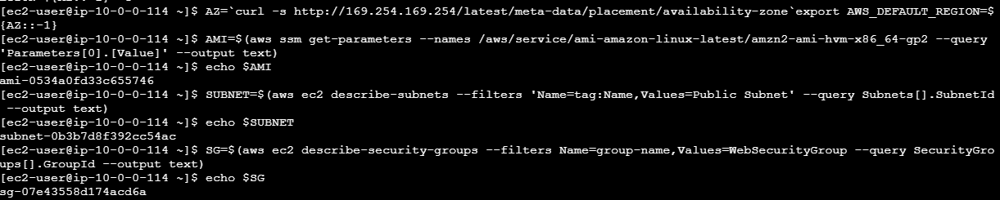

Figure 1: Bastion host creation and configuration.

 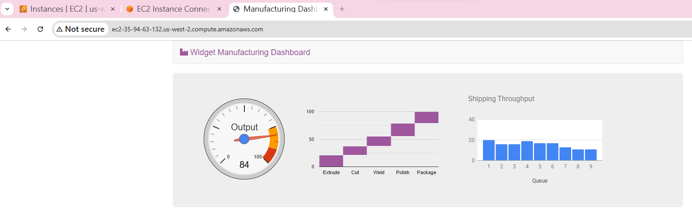
 
Figure 2: Bastion host creation and configuration.
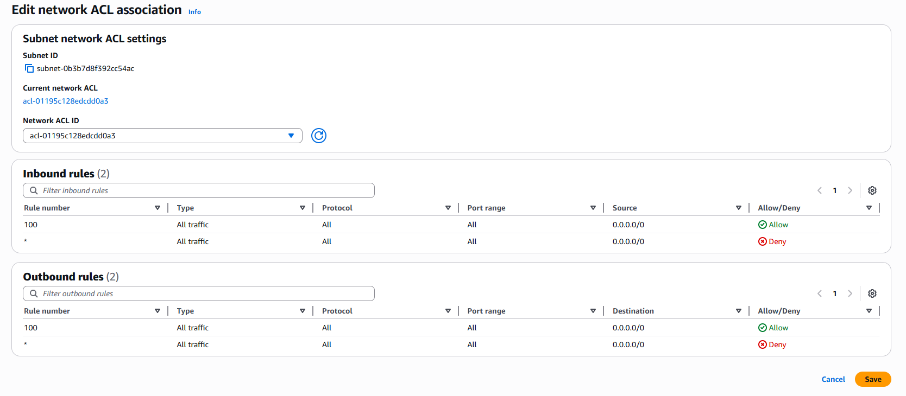
 
 
Figure 3: Bastion host creation and configuration.

**Task 2 – Connect using EC2 Instance Connect**
After the instance started running, I connected to it using EC2 Instance Connect from the AWS console. This opened a browser-based terminal where I could run AWS CLI commands.
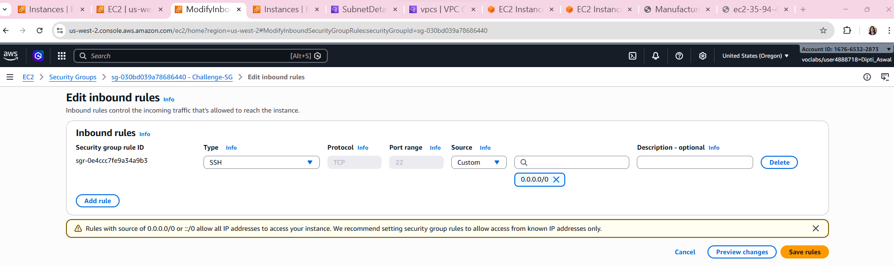

Figure 4: Connecting to the bastion host using EC2 Instance Connect.
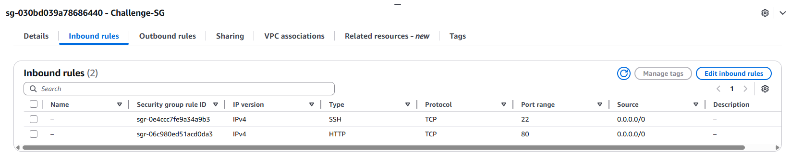

Figure 5: Connecting to the bastion host using EC2 Instance Connect.

**Task 3 – Launch Web Server using AWS CLI**
From the bastion host terminal I used AWS CLI commands to retrieve the AMI ID, subnet ID and security group ID. Then I launched another EC2 instance using the run-instances command and a user-data script that installs Apache.

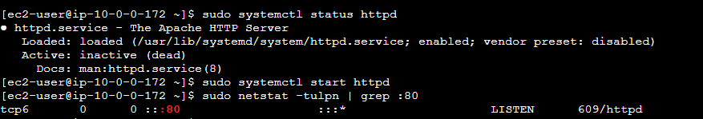
Figure 6: AWS CLI commands used to launch the web server instance.

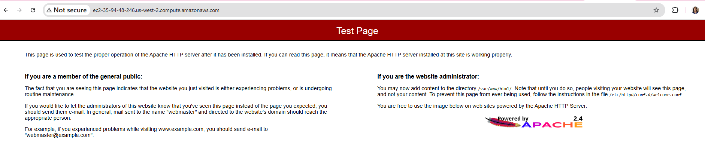
Figure 7: AWS CLI commands used to launch the web server instance.

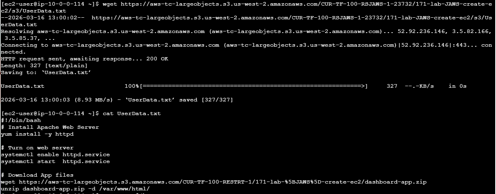
Figure 8: AWS CLI commands used to launch the web server instance.

Testing the Web Server
The public DNS of the instance was retrieved and opened in a browser. The web page loaded successfully which confirmed that the web server was running.
Public DNS: ec2-35-94-63-132.us-west-2.compute.amazonaws.com

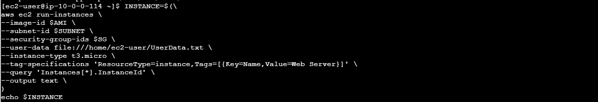
Figure 9: Web server running and page displayed.

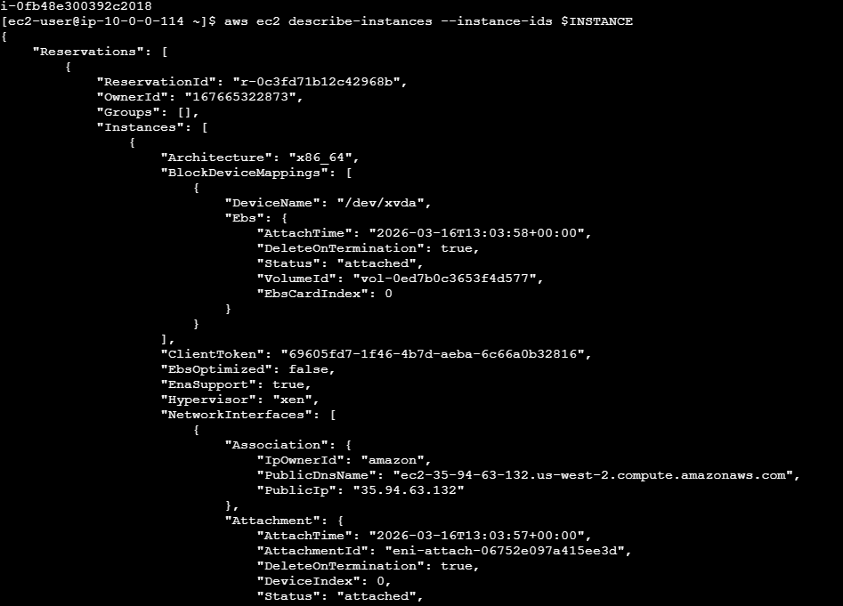
Figure 10: Web server running and page displayed.

**Challenge 1 – Fix Misconfigured Instance**
The instance could not be accessed using EC2 Instance Connect because the security group allowed the wrong port. Port 80 was configured instead of port 22. After updating the inbound rule to allow SSH on port 22, the connection worked.

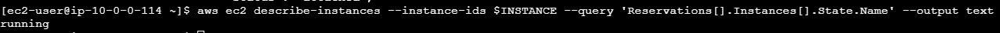
 
Figure: Security group configuration fix.

**Challenge 2 – Fix Web Server Installation**
The web page initially did not load because HTTP (port 80) was not allowed in the security group and the Apache web server was not started. After adding the HTTP rule and starting Apache, the page loaded correctly.
Command used: sudo systemctl start httpd

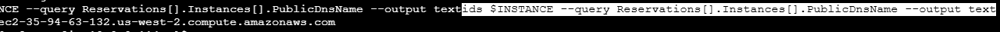
Figure: Web server working after fix.

**What I Learned**
In this lab I practiced launching EC2 instances using the console and the AWS CLI, connecting with EC2 Instance Connect, using user-data scripts to configure instances, and troubleshooting security group and web server issues.
