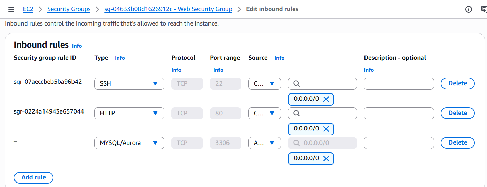
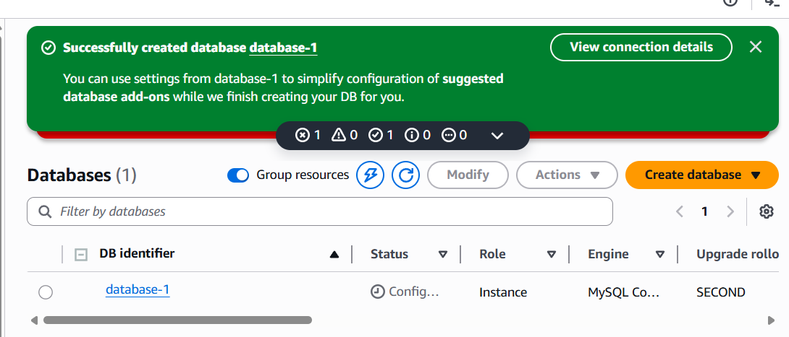
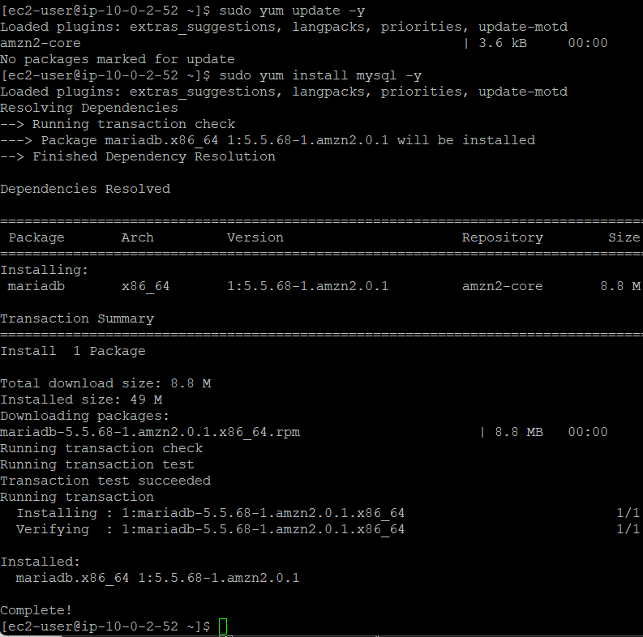
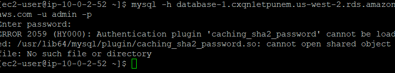
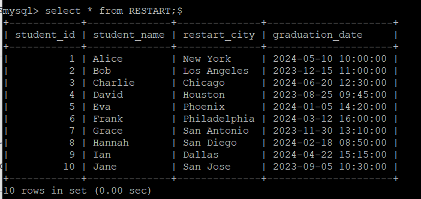
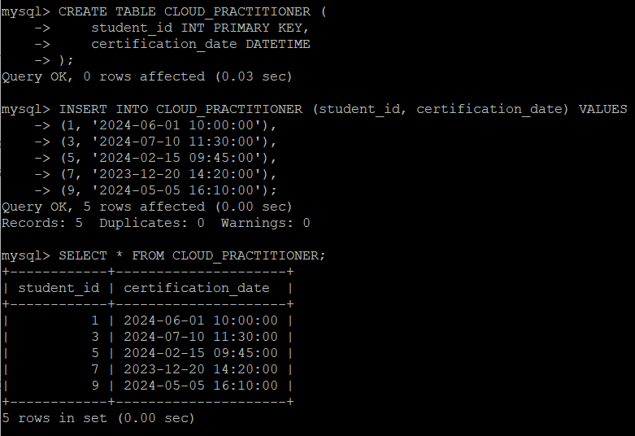
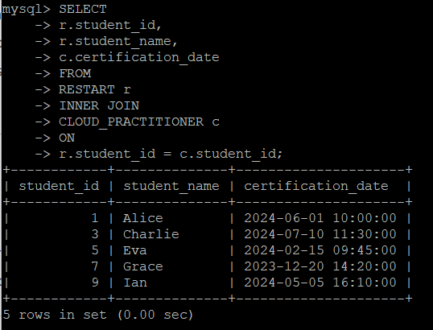

# Lab 162: Building an RDS Server and Connecting via EC2

I just finished a challenge lab where I had to set up an Amazon RDS database from scratch and get it talking to a Linux server. It was a great exercise in networking, security, and a bit of unexpected troubleshooting with Docker.

---

## Step 1: Provisioning the RDS Instance

First, I had to launch the database using either Amazon Aurora or MySQL. I went with a **MySQL engine**. There were some specific lab restrictions I had to follow to keep things within the free tier:

* **Template**: I chose the **Dev/Test**.
* **Availability**: I avoided creating a standby instance to keep it simple.
* **Instance Class**: Used a burstable **db.t3.micro** instance.
* **Storage**: Set it to **20 GB** using **General Purpose SSD (gp2)**.
* **Networking**: Made sure it was launched inside the **Lab VPC**.
* **Monitoring**: Disabled **Enhanced Monitoring** as required.



I made sure to save my credentials like the endpoint, username (`admin`), and password (`lab-password`) since I'd need those to log in later.

---

## Step 2: Fixing the Security Group

The database was up, but it was locked down. I had to go into the **Web Security Group** and add a new inbound rule so my Linux server could actually talk to the RDS instance.

* **Type**: MySQL/Aurora
* **Protocol**: TCP
* **Port**: 3306
* **Source**: I set the rule to allow the database to be accessed through port 3306



After saving the rules, the database was successfully created and ready for a connection.



---

## Step 3: Dealing with the "Authentication Plugin" Error

This is where it got tricky. I logged into my Linux server via Putty and installed the default MySQL client.



However, when I tried to connect, I got an error: `ERROR 2059 (HY000): Authentication plugin 'caching_sha2_password' cannot be loaded`.


**The Problem**: 
The MySQL client on the EC2 was too old to support the new authentication used by MySQL 8.

**Option 1**: 
Choose old version of mySQL engine like 5.7 while database creation.

OR

**Option 2**: 
If the database is already created and you don’t want to repeat creation process use below solution.
Instead of messing with broken libraries on the server, I used **Docker** to run a modern MySQL 8 client.

**The commands I used:**

```bash
sudo yum install -y docker
sudo service docker start
sudo usermod -a -G docker ec2-user
```

# I logged out and back in here to apply the group change

```bash
sudo docker run -it --rm mysql:8 mysql -h database-1.cxqn1etpunem.us-west-2.rds.amazonaws.com -u admin -p
```

## Step 4: Interacting with the Data

Once I was finally in, I switched to my database using 
```bash
USE mydb
```
and started building my tables.

Creating the Tables
I created the RESTART table for student info and inserted 10 rows of dummy data.





Running an Inner Join
To wrap things up, I created a second table called CLOUD_PRACTITIONER and ran an INNER JOIN to see which students from the main list had actually finished their certification.



**What I Learned:**

RDS Setup: How to navigate the AWS console to spin up a managed DB while following specific instance constraints.

Security: The importance of matching port 3306 in security groups to allow traffic between tiers.

Troubleshooting: Using Docker is a lifesaver when you run into "version hell" with OS packages.

