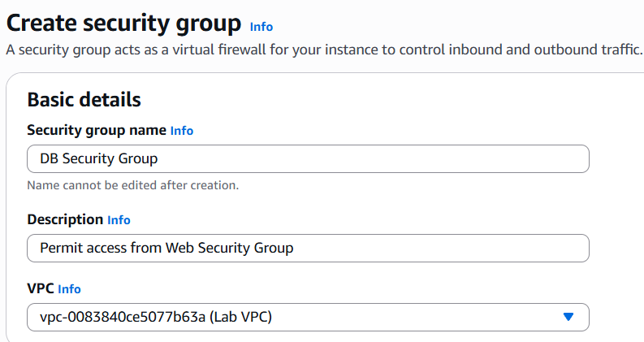
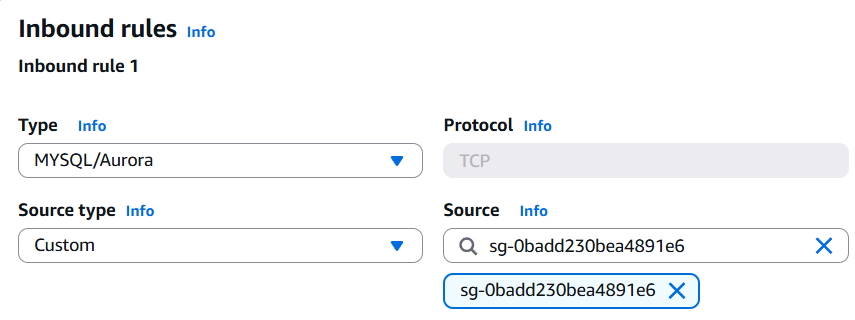
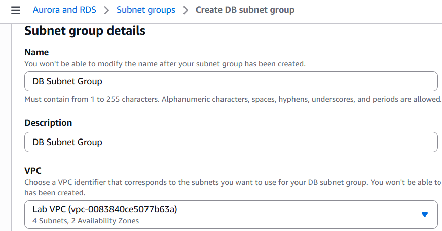
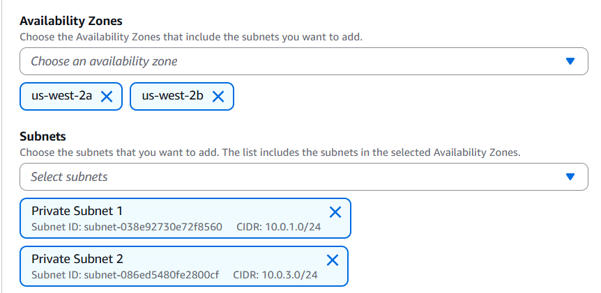
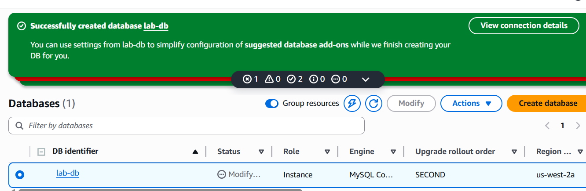
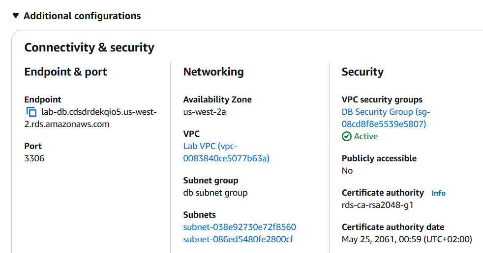
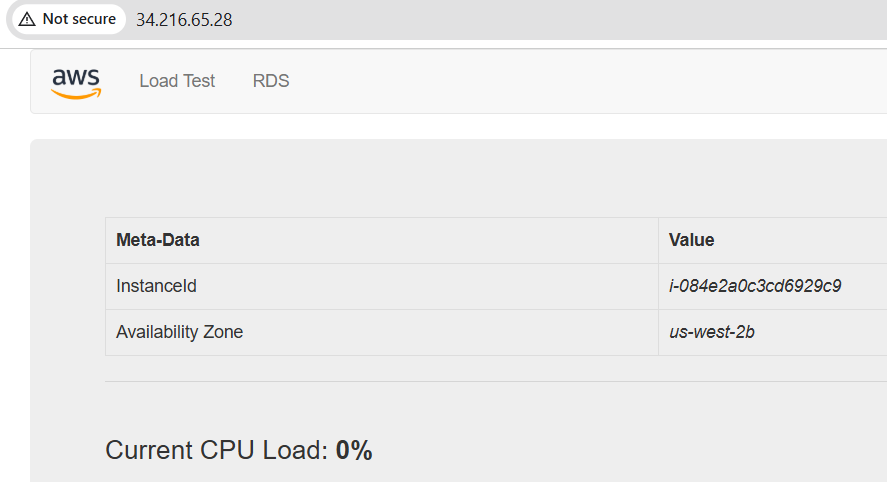

Lab 160 – Building a Database Server and Connecting via Web Application
Overview

In this lab, I built a database backend using Amazon RDS and connected it to a web application running on EC2. The setup mimics a basic real-world architecture where an application interacts with a managed database service.

Architecture

Step 1: Create Security Group for RDS

I created a security group to allow MySQL access from the EC2 instance.

Step 2: Create DB Subnet Group

Configured subnets in two availability zones:

10.0.1.0/24
10.0.3.0/24

Step 3: Launch RDS MySQL Instance
Engine: MySQL
Multi-AZ enabled
Dev/Test template

Endpoint used:

lab-db.cdsdrdekqio5.us-west-2.rds.amazonaws.com

Step 4: Connect Web Application

Accessed application:

http://34.216.65.28/rds.php

Issue Faced

Connection failed with:

Unable to establish connection

Checked logs:

sudo tail -f /var/log/httpd/error_log

Error:

mysqli_connect(): caching_sha2_password

Root Cause

MySQL 8 uses caching_sha2_password, but the PHP client does not support it.

Solution

Connected to RDS and updated authentication:

ALTER USER 'main'@'%' IDENTIFIED WITH mysql_native_password BY 'lab-password';
FLUSH PRIVILEGES;

Restarted Apache:

sudo systemctl restart httpd

Key Learnings
Multi-AZ improves availability but needs correct subnet setup
Security groups must be tightly controlled
Authentication mismatches can break connectivity
Logs are critical for debugging
