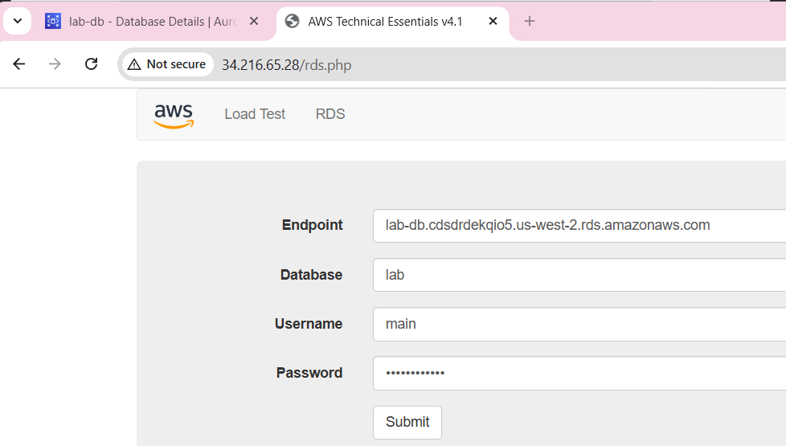
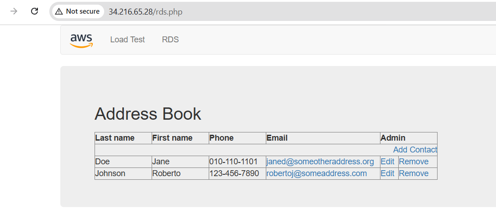

**Lab 160 – Building a Database Server and Connecting via Web Application**

Overview

In this lab, I built a database backend using Amazon RDS and connected it to a web application running on EC2. The setup mimics a basic real-world architecture where an application interacts with a managed database service.

Step 1: Create Security Group for RDS

I created a security group to allow MySQL access from the EC2 instance.

Set up inbound rules:

Step 2: Create DB Subnet Group

For Subnets, For the first Availability zone, select 10.0.1.0/24, 
For the second Availability zone, select 10.0.3.0/24

Configured subnets in two availability zones:

Step 3: Launch RDS MySQL Instance

Engine: MySQL
Multi-AZ enabled
Dev/Test template

I will now configure and launch a Multi-AZ Amazon RDS for MySQL database instance.
Full configuration – MySQL engine, Mutli AZ DB instance using Dev/Test template
Storage – General purpose SSD, choose Lap VPC, DB security group
Click on create database

Endpoint used:

lab-db.cdsdrdekqio5.us-west-2.rds.amazonaws.com

Step 5: Connect Web Application

Accessed application:

http://34.216.65.28/rds.php

Click on RDS and interact with the database:

Challenge faced:

In the final step, while connecting to RDS from app, I got below error:
“Unable to Establish Connection....”

I checked error logs. For that, I connected to the EC2 using ssh client and .ppk file and logged in as ec2-user and checked the logs:
[ec2-user@ip-10-0-2-227 ~]$ sudo tail -f /var/log/httpd/error_log

Error:
mysqli_connect(): The server requested authentication method unknown to the client [caching_sha2_password]
Issue is: 
RDS MySQL is using: caching_sha2_password (default in MySQL 8)
and the PHP (mysqli client) is too old to support it.

Solution:

Update MySQL user to use: mysql_native_password
To do that run below command to connect to RDS from EC2:

mysql -h lab-db.cdsdrdekqio5.us-west-2.rds.amazonaws.com -u main -p
Enter password: lab-password

Run below commands:

ALTER USER 'main'@'%' IDENTIFIED WITH mysql_native_password BY 'lab-password';
FLUSH PRIVILEGES;

sudo systemctl restart httpd

Then retry the app: http://34.216.65.28/rds.php

The Address Book would come up now.

**Key Learnings**

Multi-AZ improves availability but needs correct subnet setup
Security groups must be tightly controlled
Authentication mismatches can break connectivity
Logs are critical for debugging
