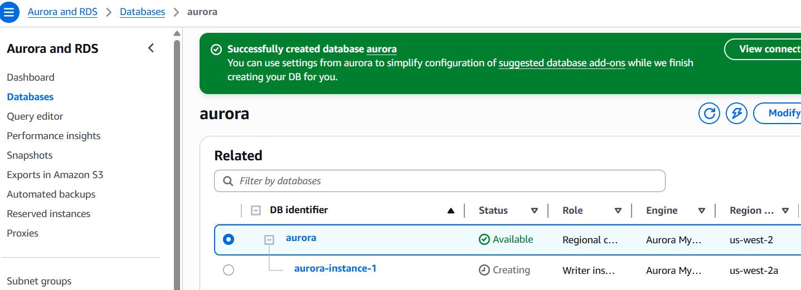
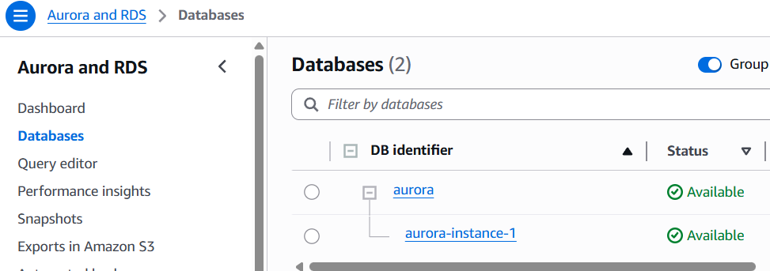
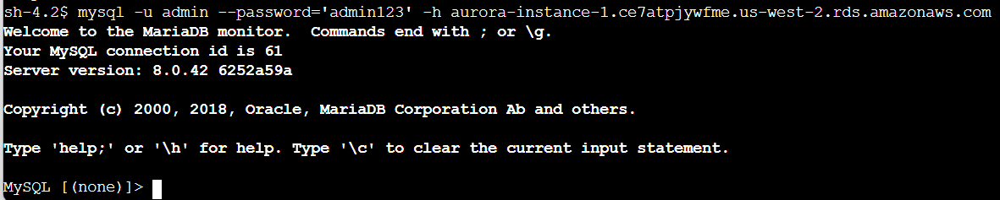
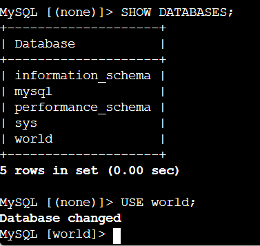
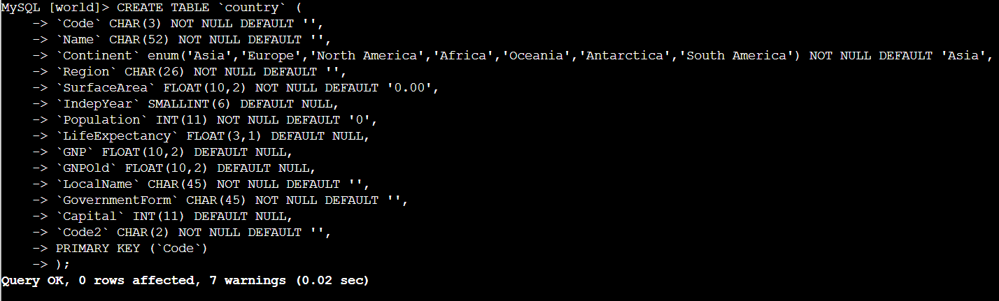
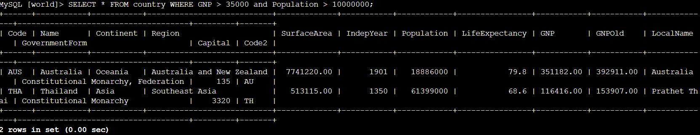

# Lab 274: Introduction to Amazon Aurora

In this lab, I walked through the basics of setting up and interacting with an Amazon Aurora database. 

Here is what I accomplished:
* Created an Aurora instance.
* Connected to a pre-created Amazon Elastic Compute Cloud (Amazon EC2) instance.
* Configured the Amazon EC2 instance to connect to Aurora.
* Queried the Aurora instance.

## Core AWS Concepts Covered

Before jumping into the steps, here is a quick overview of the services used:

* **Amazon Aurora:** This is a fully managed, MySQL-compatible relational database engine. It combines the performance and reliability of high-end commercial databases with the simplicity and cost-effectiveness of open-source options. It delivers up to five times the performance of MySQL without requiring changes to most existing MySQL-based applications.
* **Amazon EC2:** This is a web service providing resizable compute capacity in the cloud. It is designed to make web-scale cloud computing easier for developers by reducing the time required to provision new server instances to minutes, which allows you to quickly scale capacity up or down as needed.
* **Amazon RDS:** Amazon Relational Database Service makes it easy to set up, operate, and scale a relational database in the cloud. It manages time-consuming database administration tasks and provides cost-efficient, resizable capacity. It offers six database engines, including Aurora, Oracle, Microsoft SQL Server, PostgreSQL, MySQL, and MariaDB.

---

## Lab Steps

### Step 1: Create the Database
I logged into the AWS console and selected "Create database" using the Full configuration option.



### Step 2: Configure the EC2 Linux Instance
I logged into the pre-created EC2 instance using Session Manager. To get the necessary database client tools, I installed MariaDB by running `sudo yum install mariadb -y`. 

I then went back to the AWS RDS dashboard and waited until `aurora-instance-1` displayed a status of "Available".



### Step 3: Connect to Aurora
I grabbed the database endpoint from the console: `aurora-instance-1.ce7atpjywfme.us-west-2.rds.amazonaws.com`. Using the MariaDB client on the EC2 instance, I connected to the Aurora database.



### Step 4: Create Tables, Insert, and Query Data
With the connection established, I created a new table to verify functionality.





Next, I inserted test records into the database. Here is the SQL I ran:

```sql
INSERT INTO `country` VALUES ('GAB','Gabon','Africa','Central Africa',267668.00,1960,1226000,50.1,5493.00,5279.00,'Le Gabon','Republic',902,'GA');
INSERT INTO `country` VALUES ('IRL','Ireland','Europe','British Islands',70273.00,1921,3775100,76.8,75921.00,73132.00,'Ireland/Éire','Republic',1447,'IE');
INSERT INTO `country` VALUES ('THA','Thailand','Asia','Southeast Asia',513115.00,1350,61399000,68.6,116416.00,153907.00,'Prathet Thai','Constitutional Monarchy',3320,'TH');
INSERT INTO `country` VALUES ('CRI','Costa Rica','North America','Central America',51100.00,1821,4023000,75.8,10226.00,9757.00,'Costa Rica','Republic',584,'CR');
INSERT INTO `country` VALUES ('AUS','Australia','Oceania','Australia and New Zealand',7741220.00,1901,18886000,79.8,351182.00,392911.00,'Australia','Constitutional Monarchy, Federation',135,'AU');
```



I have now successfully:

•	Created an Aurora instance.
•	Connected to a pre-created Amazon EC2 instance.
•	Configured the Amazon EC2 instance to connect to Aurora.
•	Queried the Aurora instance.
