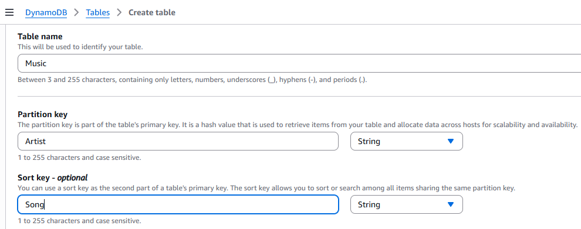
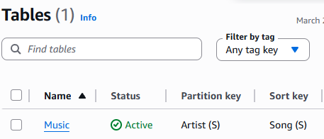
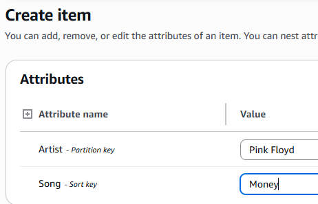
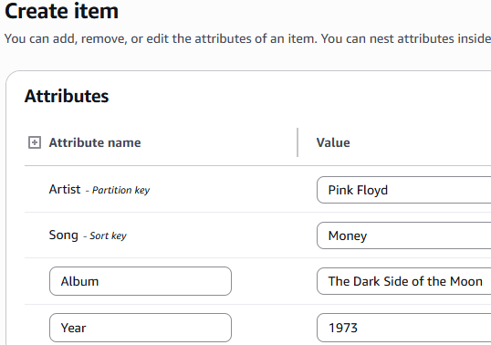
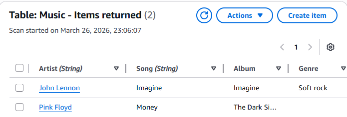
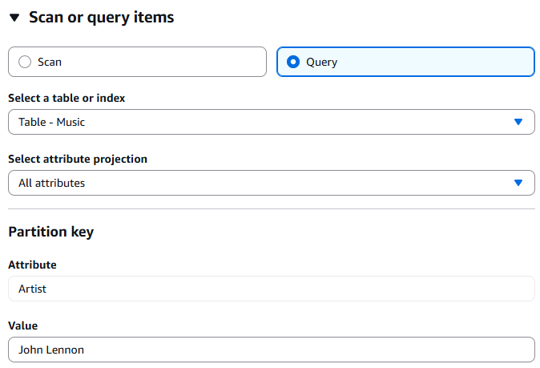
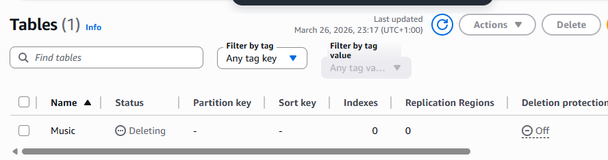

# Lab 275: Introduction to Amazon DynamoDB [cite: 37]

In this lab, I continued my AWS learning by exploring Amazon DynamoDB. 

Here is what I accomplished:

* Created an Amazon DynamoDB table
* Entered data into an Amazon DynamoDB table
* Queried an Amazon DynamoDB table 
* Deleted an Amazon DynamoDB table

---

## Lab Steps

### Step 1: Create the Table
I started by navigating to the DynamoDB service in the AWS console and selecting the option to create a table. I named the table "Music", set the partition key to "Artist" (String), and added an optional sort key called "Song" (String). 

[cite_start]After confirming the settings, I waited a moment for the table status to show as "Active". 

### Step 2: Add Data to the Table
With the table ready, I selected my database and chose to create a new item. 

I entered "Pink Floyd" as the Artist and "Money" as the Song. Because DynamoDB is flexible, I could dynamically add new attributes to this specific item, so I added "Album" (The Dark Side of the Moon) and "Year" (1973). 

After saving, I could view the items returned by the table scan to confirm my new entry was successfully stored. 

### Step 3: Modify an Existing Item
Next, I practiced updating a record. I selected the "Music" table, opened the item for "John Lennon", and updated the year attribute from 1971 to 1972. 

### Step 4: Query the Table
Instead of running a full scan, I used the Query function to efficiently find specific records. I selected the query option and set the partition key (Artist) value to "John Lennon" to retrieve only his items. 

### Step 5: Clean Up
To wrap up the lab and ensure I didn't leave unnecessary resources running, I deleted the table. [cite: 51] [cite_start]I selected the table, opened the update settings, and executed the delete table command. 

## Summary
This lab gave me a great hands-on introduction to NoSQL databases in AWS. I successfully provisioned a DynamoDB table, manipulated data by adding and modifying items, queried for specific records, and then tore down the infrastructure.
