## Lab 179: Migrating to Amazon RDS

In this lab, I walked through the process of migrating a local database to Amazon RDS. To establish a baseline, I started by placing an order on the cafe menu, checking the order history, and saving it.

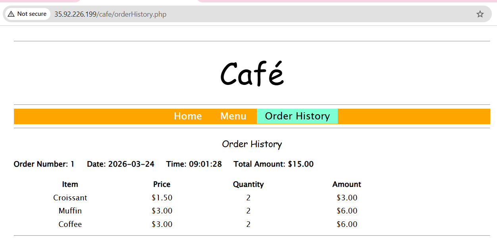

Here is a breakdown of the steps I took to complete the migration.

## Step 1: Configure AWS Infrastructure via CLI

I created the prerequisite infrastructure components for the Amazon RDS instance using the AWS CLI. This included a security group, two private subnets, and a database subnet group.

First, I created the security group (`CafeDatabaseSG`) for the VPC.
Next, I created an inbound rule for the security group to allow connections from TCP port 3306. I verified this rule was successfully created using the `describe-security-groups` command.

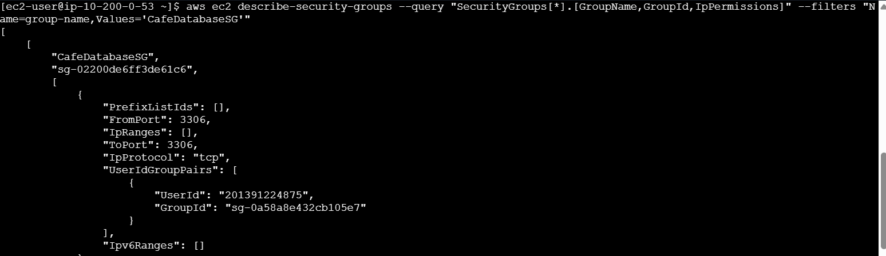

I then created two private subnets:

* **CafeDB Private Subnet 1:** This subnet hosts the RDS DB instance and is in the same Availability Zone as the CafeInstance (us-west-2a).
* **CafeDB Private Subnet 2:** This is an empty private subnet in a different Availability Zone (us-west-2b), which is required to form the database subnet group.

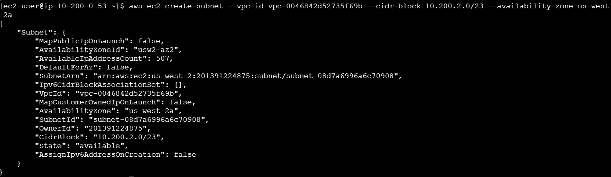

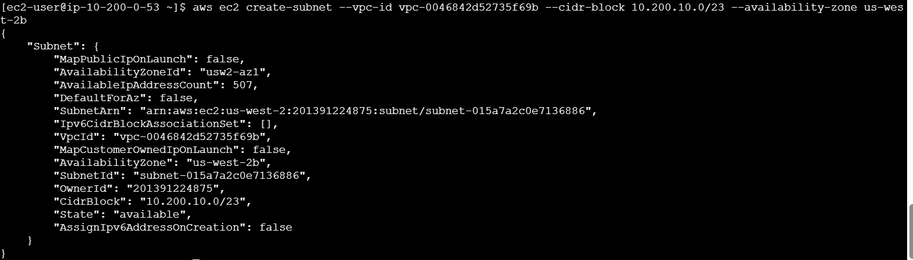

Finally, I combined these two subnets to create the `CafeDB Subnet Group`.

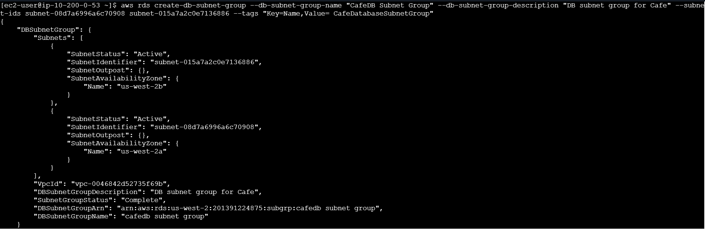

## Step 2: Create the Amazon RDS MariaDB Instance

With the networking in place, I created the RDS instance. I ran the `aws rds create-db-instance` command, specifying the MariaDB engine (version 10.6), a `db.t3.micro` instance class, and associating it with the subnet group and security group I just built.

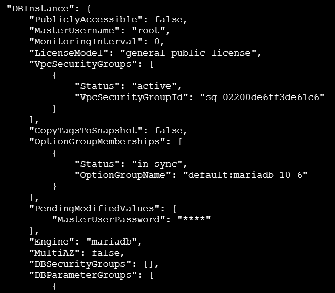

I monitored the status of the database using the `describe-db-instances` command. I waited until the status changed from "backing-up" to "available" and noted the database endpoint address. 

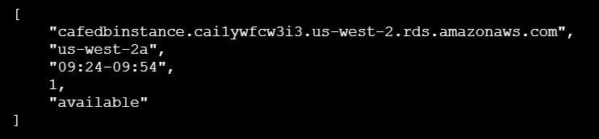

## Step 3: Migrate Application Data

Next, I migrated the data from the existing local database to the new Amazon RDS database.

* I connected to the CafeInstance using EC2 Instance Connect.
* I used the `mysqldump` utility to create a backup of the local database into a file named `cafedb-backup.sql`.
* I restored this backup to the Amazon RDS database by connecting to the RDS endpoint and piping the SQL file into it.

To verify the migration, I opened an interactive MySQL session to the RDS instance and ran a `Select * from product;` query.

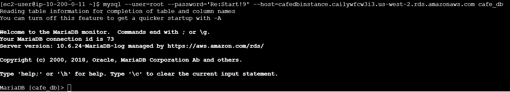

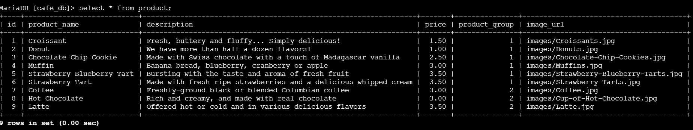

## Step 4: Configure the Website to use RDS
To point the application to the new database, I went into the AWS Systems Manager and accessed the Parameter Store. 

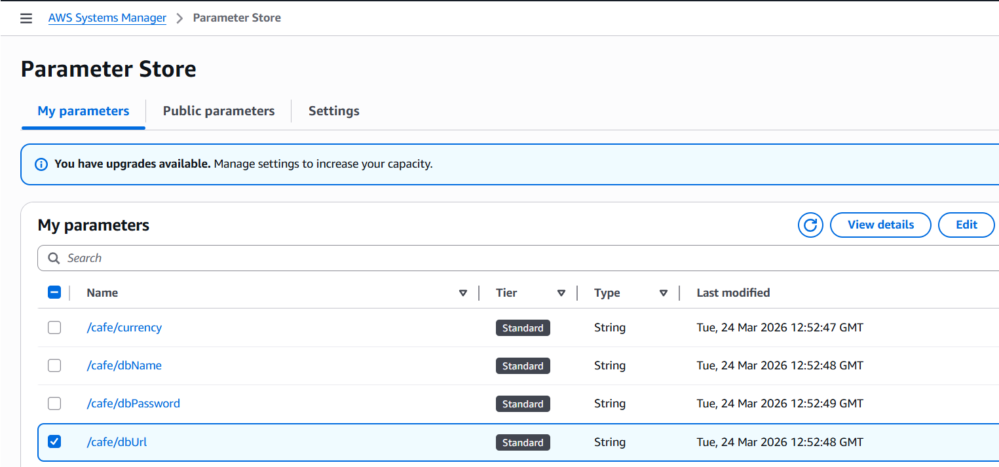

I edited the `/cafe/dbUrl` parameter and replaced the local value with the new RDS instance database endpoint address. The application now references the RDS DB instance instead of the local database.

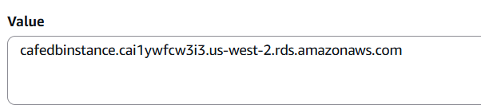

I tested this by navigating back to the cafe website and checking the order history. It successfully loaded and matched the order I captured earlier.

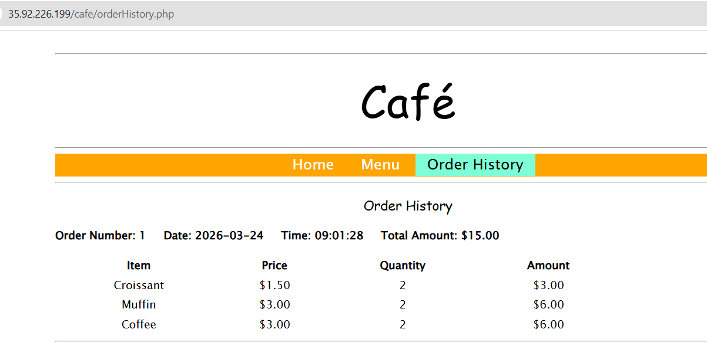

## Step 5: Monitor the Database

For the final step, I navigated to the Aurora and RDS section of the AWS console to view the monitoring tab. 

I observed the database connections metric. By connecting to the database from instance connect and running a query, I could see the active connections spike to 1. Upon exiting the interactive SQL session, the connections dropped back to 0.

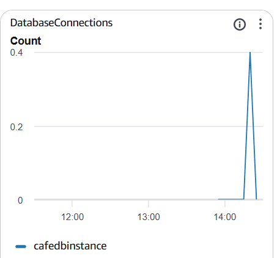

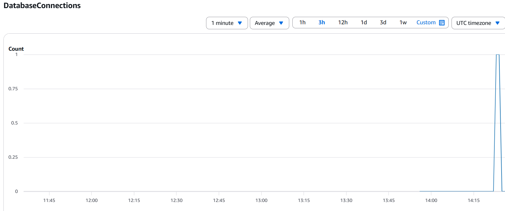

# Conclusion

In this lab, I successfully:

* Created an Amazon RDS MariaDB instance by using the AWS CLI.
* Migrated data from a MariaDB database on an EC2 instance to an Amazon RDS MariaDB instance.
* Monitored the Amazon RDS instance by using CloudWatch metrics.
