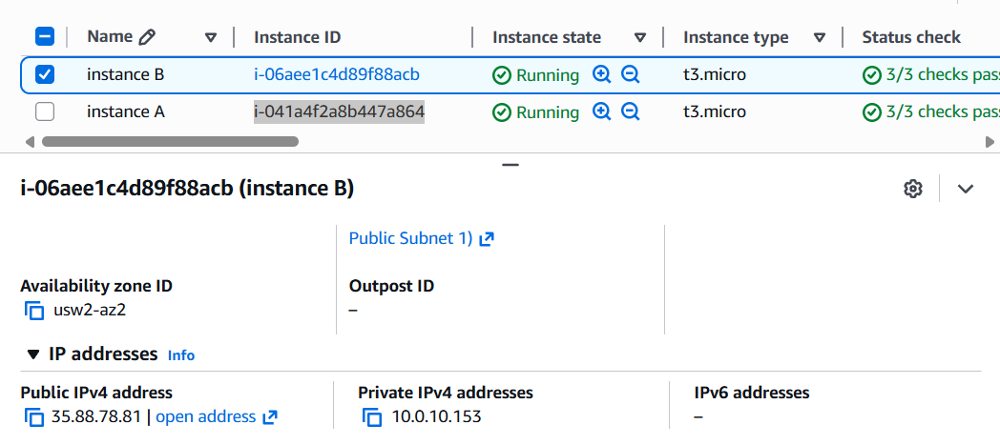
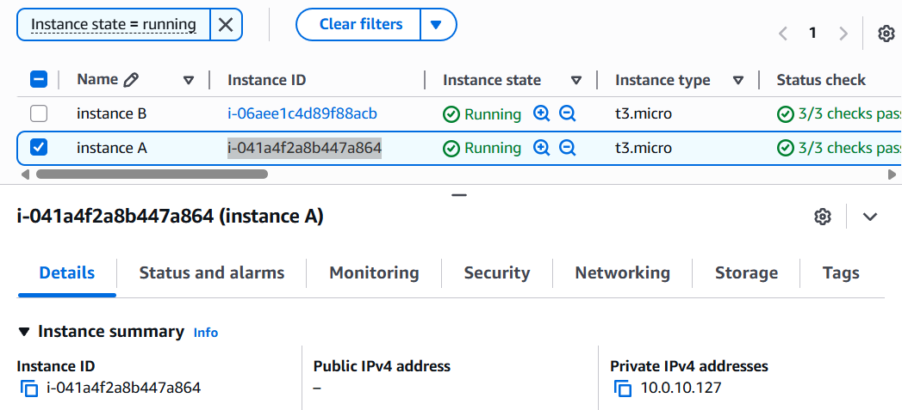
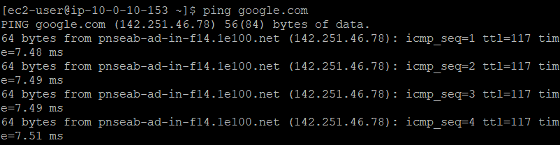
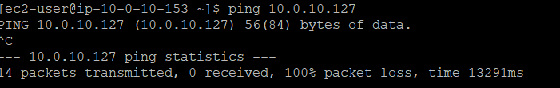
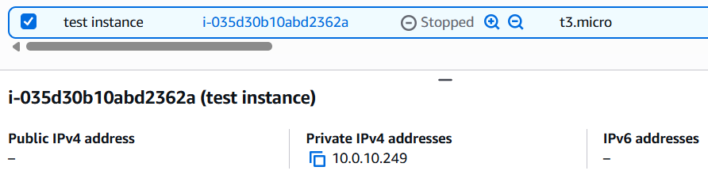
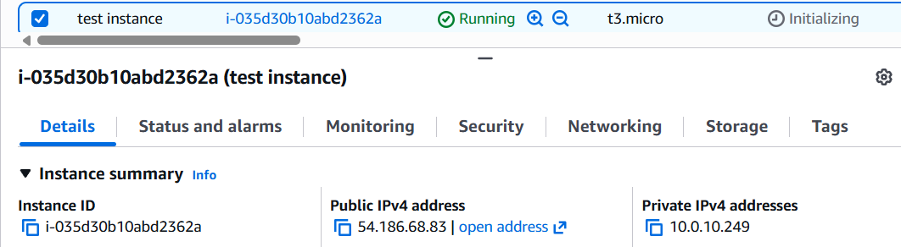
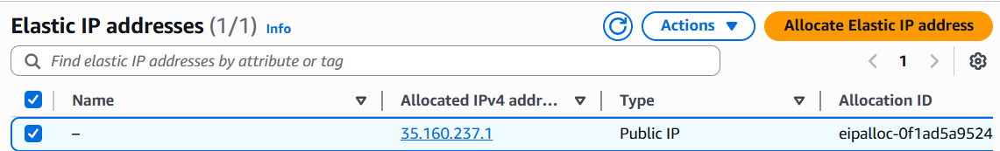
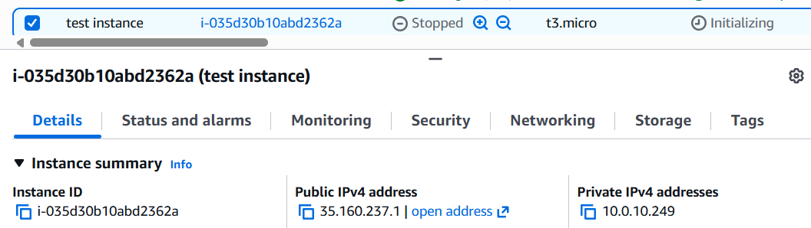

# Labs 261 & 262: Troubleshooting VPC Connectivity and IP Addressing

As a Cloud Support Engineer at AWS, I investigated a customer ticket regarding a networking issue where Instance A could not reach the internet while Instance B functioned correctly, despite both being in the same subnet. I used the OSI model as a framework to troubleshoot from the instance layer up through the networking layers to resolve the issue.

---

## Lab 261: Public vs. Private IP Troubleshooting

### 1. Investigating the Customer Scenario
I replicated the customer's environment to analyze why Instance A was isolated. I found that although both instances were in the same Lab VPC, their IP configurations were different:

* **Instance B (i-06aee1c4d89f88acb)**: Configured with both a Public IPv4 (35.88.78.81) and a Private IPv4 address (10.0.10.153).
* **Instance A (i-041a4f2a8b447a864)**: Configured with only a Private IPv4 address (10.0.10.127). It lacks a public entry point.

### 2. Connectivity Testing & Troubleshooting
I logged into **Instance B** via SSH to test network reachability:
* **External Check**: Successfully pinged `google.com`, confirming Instance B has a functional route to the internet.
* **Internal Check**: Successfully pinged **Instance A's private IP** from Instance B.

### 3. Lab Findings
The troubleshooting proved that the VPC routing and Internet Gateway are correctly configured. Instance A cannot reach the internet because it was assigned **only a private IP address**. Private IPs are used for internal communication within a VPC and cannot establish direct connections to the outside world.

---

## Lab 262: Managing Static and Dynamic Addresses

### 1. The Issue: Dynamic IP Behavior
I investigated a problem where an EC2 instance's public IP changed every time it was stopped and started, breaking customer configurations.

* **Initial State**: Noted the original public IP (35.88.157.67).
* **Action**: Stopped the instance. The public IP was immediately released, though the private IP remained.

* **Action**: Restarted the instance. AWS assigned a new, random dynamic public IP (54.186.68.83).

### 2. The Solution: Implementing an Elastic IP (EIP)
To provide a persistent entry point, I allocated and associated an **Elastic IP address** with the instance:

### 3. Final Verification
I performed another stop/start cycle to verify the static solution:
* **Stop Check**: The IP address remained associated with the instance.
* **Start Check**: The instance retained the same static IP (35.160.237.1) after restart.

---

### Key Takeaways and Recommendations:
* **VPC Networking**: Internal traffic uses private IPs; internet access requires a public IP.
* **Public IP Persistence**: Standard public IPs are dynamic. Use **Elastic IPs** for any workload requiring a persistent public identity.
* **Public CIDR Warning**: I recommend against using a public CIDR range (like 12.0.0.0/16) for a VPC as it can cause routing complications and unexpected replies from unrelated internet resources.
