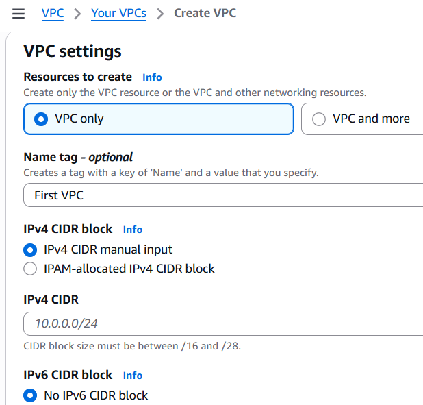
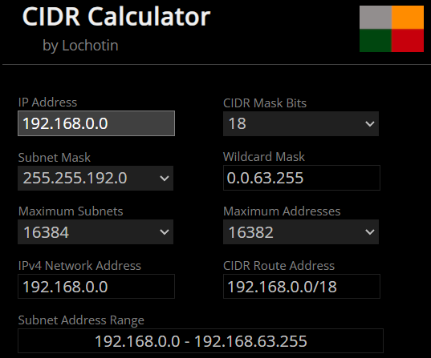
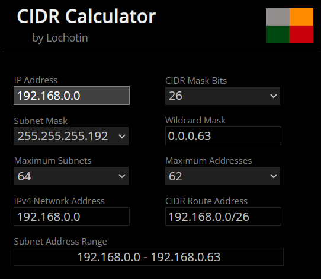
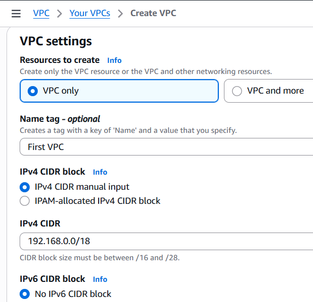
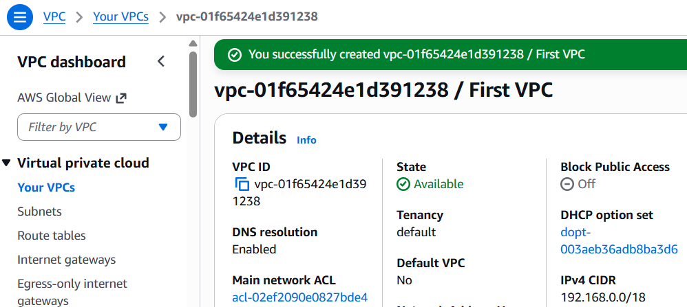
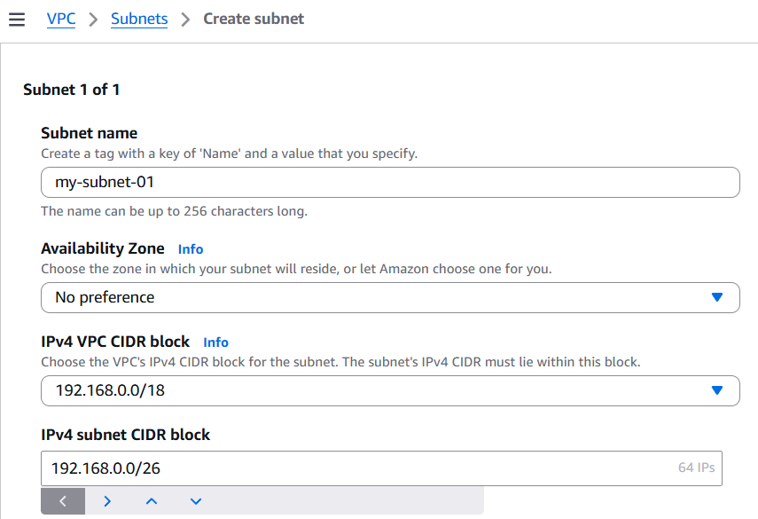
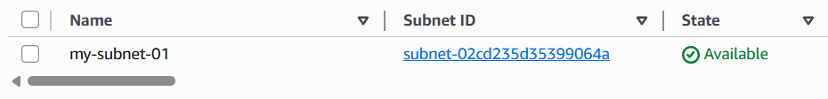
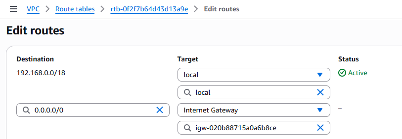
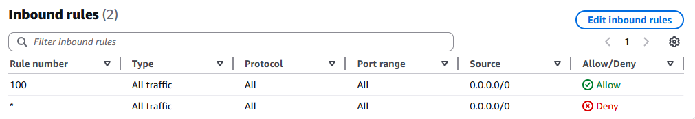

# Labs 263 & 264: Building Custom VPC Infrastructure and Networking Resources

In these labs, I acted as a Cloud Architect to design and implement a custom networking environment based on specific customer requirements for scale and security. I focused on IP address allocation using CIDR math and the deployment of a fully routable VPC.

---

## Lab 263: Subnetting and IP Allocation

### 1. Understanding Customer Requirements
A customer needed to build a VPC with a private IPv4 range (192.x.x.x) capable of supporting approximately **15,000 private IP addresses** for a headquarters office and at least **50 IP addresses** for a public operations subnet.

### 2. Validating Private IP Ranges (RFC 1918)
The customer requested a "192.x.x.x" range. I confirmed that not all 192.x.x.x ranges are private; specifically, only the **192.168.0.0/16** range is valid for private networking according to RFC 1918.

| Range | CIDR |
| :--- | :--- |
| 10.0.0.0 – 10.255.255.255 | /8 |
| 172.16.0.0 – 172.31.255.255 | /12 |
| 192.168.0.0 – 192.168.255.255 | /16 |

### 3. Calculating CIDR Blocks
I used a CIDR calculator to find the exact mask bits required to meet the address requirements:
* **VPC (15,000+ IPs)**: I selected **192.168.0.0/18**, which provides **16,382** addresses.
* **Public Subnet (50+ IPs)**: I selected **192.168.0.0/26**, which provides **62** addresses (57 usable after AWS reserves 5).

---

## Lab 264: Creating Networking Resources

### 1. Provisioning the VPC and Subnet
I created the VPC named "First VPC" using the manual IPv4 CIDR input of **192.168.0.0/18**.

Next, I established the subnet within that VPC using the **/26** range to satisfy the 50+ IP requirement for the operations department.

### 2. Establishing Internet Connectivity
To make the network routable, I created an **Internet Gateway (IGW)** and attached it to the VPC. I then updated the **Route Table** to include a default route (**0.0.0.0/0**) targeting the IGW so traffic can reach the internet.

### 3. Layered Security (NACLs and Security Groups)
I implemented a two-tier security model:
* **Network ACL (Stateless)**: Added Rule 100 to allow all inbound/outbound traffic at the subnet level. NACLs evaluate rules from lowest to highest, so this allows all traffic before the default "Deny" rule is reached.

* **Security Group (Stateful)**: Configured a virtual firewall at the instance level to specifically allow **SSH, HTTP, and HTTPS** traffic.

### 4. Final Verification
I launched an EC2 instance in the new subnet and confirmed connectivity by successfully pinging `google.com`. This verified that the entire stack—VPC, Subnet, IGW, Route Table, NACL, and Security Group—was correctly configured for internet access.

---

### Key Takeaways:
* **IP Planning**: Proper CIDR calculation ensures enough growth room while staying within private RFC 1918 boundaries.
* **Stateless vs. Stateful**: Security Groups are stateful firewalls at the instance level, while NACLs are stateless firewalls at the subnet level.
* **Network Flow**: All resources must be correctly associated with the Route Table and IGW to achieve external reachability.
