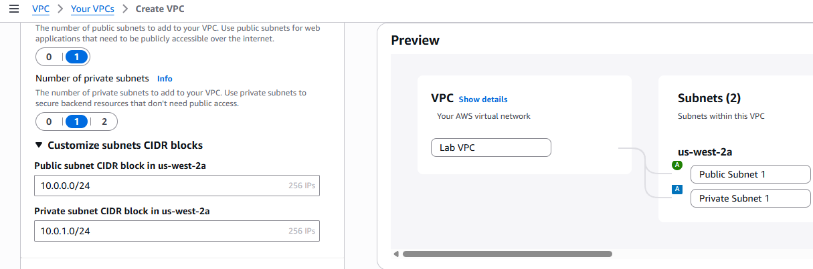
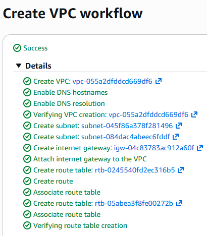
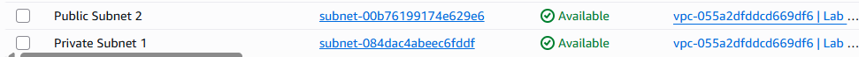
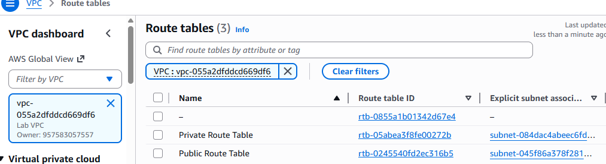
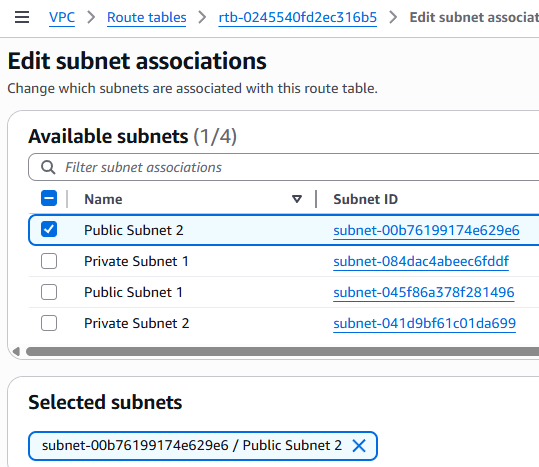
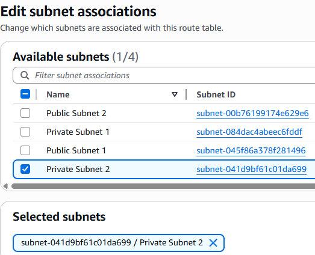
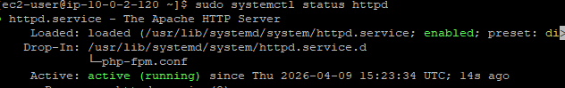
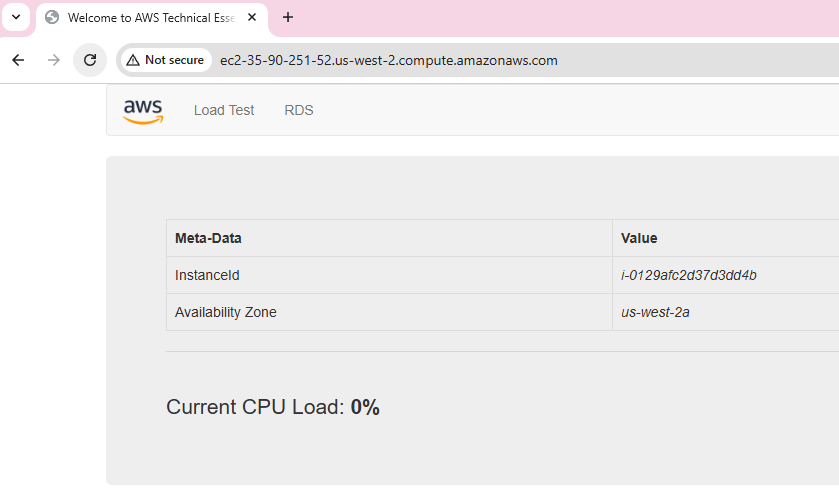

# Lab 267 – Build My Own VPC and Launch a Web Server

In this lab, I created a custom VPC, configured subnets, routing, security groups, and deployed an EC2 instance running a web server inside the VPC.

I started by creating a VPC using **VPC and More**, selecting 1 Availability Zone, 1 public subnet, and 1 private subnet. I renamed the resources as LabVPC, along with public and private subnets and their associated route tables.



The VPC workflow was created successfully.



Next, I created additional subnets inside LabVPC. I created a second public subnet named Public Subnet 2 with CIDR 10.0.2.0/24 and a second private subnet named Private Subnet 2 with CIDR 10.0.3.0/24. Both subnets were created in no specific availability zone.



After creating the subnets, I associated them with the appropriate route tables. I filtered resources for LabVPC, edited subnet associations, and ensured Public Subnet 2 was associated correctly with the public route table.



After updating associations, the VPC now had properly configured public and private subnets across the environment.



Next, I created a security group for the web server to control inbound traffic.



After that, I launched an EC2 instance to host a web server. I named it Web Server 1 and selected Amazon Linux 2 as the AMI with instance type t3.micro. I placed the instance inside LabVPC under Public Subnet 2, enabled auto-assign public IP, and attached the Web Security Group. I also used a user data script to install Apache, PHP, and download the web application.

```bash
#!/bin/bash
yum install -y httpd mysql php
wget https://aws-tc-largeobjects.s3.us-west-2.amazonaws.com/CUR-TF-100-RESTRT-1/267-lab-NF-build-vpc-web-server/s3/lab-app.zip
unzip lab-app.zip -d /var/www/html/
chkconfig httpd on
service httpd start

```

## Issue:

After the instance launched successfully, I tried accessing the web application using the public DNS, but the page was not reachable and showed a connection refused error.


To identify the issue, I tried to connect to the EC2 instance but couldn’t. When checked the Security group doesn’t contain any inbound rule for SSH. So, added the required inbound rule (SSH, port 22) for the security group.
Once done logged in to the web server and checked the status for the Apache server.
```bash
[ec2-user@ip-10-0-2-120 ~]$ sudo systemctl status httpd

Unit httpd.service could not be found.
```

The apache httpd service is down. Looks like the script in User data did not install the required Apache service and other libraries so need to run the script directly on the server. 

This is because of package mysql. In the script:

```bash
yum install -y httpd mysql php
```

In User data, if one package fails others are also not installed without fallback or retry.
On Amazon Linux 2, the mysql package: is deprecated in default repos Its replaced by mariadb or mysql-server


## Solution

To fix this, SSH to the web server and Install Apache properly (without mysql) and started Apache:

```bash
sudo yum install -y httpd php unzip
sudo systemctl start httpd
sudo systemctl enable httpd
```

Verify service
sudo systemctl status httpd


Then I downloaded the application files manually into /var/www/html, extracted them, and restarted Apache:

```bash
cd /var/www/html
sudo wget https://aws-tc-largeobjects.s3.us-west-2.amazonaws.com/CUR-TF-100-RESTRT-1/267-lab-NF-build-vpc-web-server/s3/lab-app.zip
sudo unzip lab-app.zip
sudo systemctl restart httpd
```

After this, the web server started working successfully and I was able to access the application using the EC2 public DNS.



Alternatively, I noted that the correct approach is to fix the user data script by removing mysql and using only httpd, php, and unzip, ensuring Apache installs correctly during launch:

```bash
#!/bin/bash
yum update -y
yum install -y httpd php unzip
systemctl start httpd
systemctl enable httpd
cd /var/www/html
wget https://aws-tc-largeobjects.s3.us-west-2.amazonaws.com/CUR-TF-100-RESTRT-1/267-lab-NF-build-vpc-web-server/s3/lab-app.zip
unzip lab-app.zip
```


