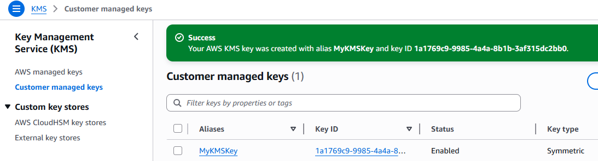
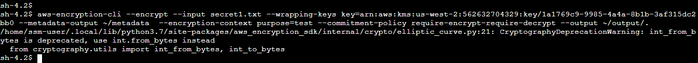

# Lab 278 – Data Protection Using Encryption

In this lab, I implemented data protection using AWS Key Management Service (KMS) and the AWS Encryption CLI. I created a KMS key, installed the encryption CLI on an EC2 instance, and performed encryption and decryption of files.

---

## Lab Objectives

- Create an AWS KMS customer managed key  
- Install AWS Encryption CLI on EC2 instance  
- Encrypt plaintext files using KMS key  
- Decrypt ciphertext back to readable format  

---

## Create AWS KMS Key

I created a customer managed KMS key from the AWS KMS console.

**Configuration:**
- Key type: Symmetric  
- Alias: MyKMSKey  
- Description: Key used to encrypt and decrypt data files  

**Permissions:**
- Key administrators: voclabs  
- Key users: voclabs  

After creation, I copied the key ARN.

**KMS Key ARN:**
arn:aws:kms:us-west-2:562632704329:key/1a1769c9-9985-4a4a-8b1b-3af315dc2bb0

---

## Configure EC2 File Server Instance

I connected to the EC2 instance using Session Manager.

Then I installed and configured AWS Encryption CLI.

Commands used:

pip3 install aws-encryption-sdk-cli  
export PATH=$PATH:/home/ssm-user/.local/bin  

---

## Create Sample Files

I created sample files containing sensitive data.

Commands:

touch secret1.txt secret2.txt secret3.txt  
echo "TOP SECRET 1!!!" > secret1.txt  
mkdir output  

---

## Encrypt Data Using AWS KMS

I used the AWS Encryption CLI to encrypt the file using the KMS key.

Command:

aws-encryption-cli --encrypt \
--input secret1.txt \
--wrapping-keys key=arn:aws:kms:us-west-2:562632704329:key/1a1769c9-9985-4a4a-8b1b-3af315dc2bb0 \
--metadata-output ~/metadata \
--encryption-context purpose=test \
--commitment-policy require-encrypt-require-decrypt \
--output ~/output/.

After encryption, the output file was generated.

Command:

ls output  
secret1.txt.encrypted  

---

## View Encrypted File

I verified the encrypted file content.

Command:

cat output/secret1.txt.encrypted  

The file was successfully encrypted and unreadable in ciphertext format.

---

## Decrypt Data Using AWS KMS

I decrypted the encrypted file using the same KMS key.

Command:

aws-encryption-cli --decrypt \
--input secret1.txt.encrypted \
--wrapping-keys key=arn:aws:kms:us-west-2:562632704329:key/1a1769c9-9985-4a4a-8b1b-3af315dc2bb0 \
--commitment-policy require-encrypt-require-decrypt \
--encryption-context purpose=test \
--metadata-output ~/metadata \
--max-encrypted-data-keys 1 \
--buffer \
--output .

---

## Verify Decryption

I verified that the original plaintext was restored.

Command:

cat secret1.txt.encrypted.decrypted  

Output:
TOP SECRET 1!!!

---

## Conclusion

In this lab, I learned how to:

- Create and use AWS KMS customer managed keys  
- Install and configure AWS Encryption CLI  
- Encrypt plaintext data into ciphertext  
- Decrypt ciphertext back into readable form  

This demonstrates how AWS KMS provides secure encryption and controlled key management for sensitive data.
