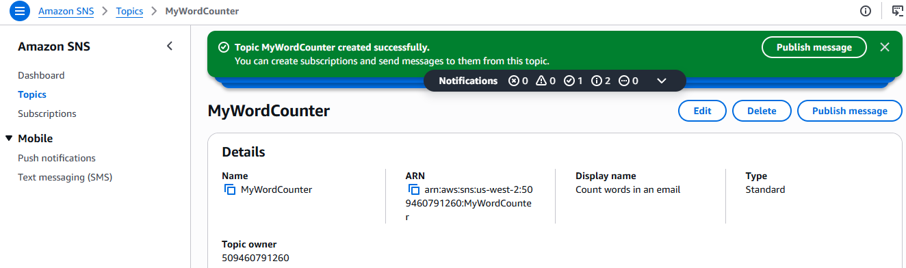
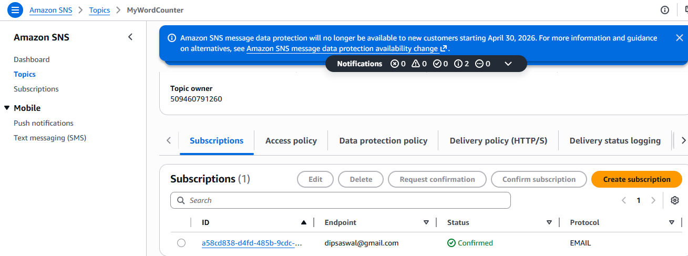
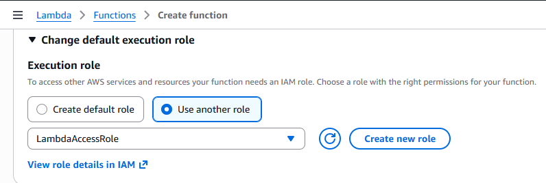
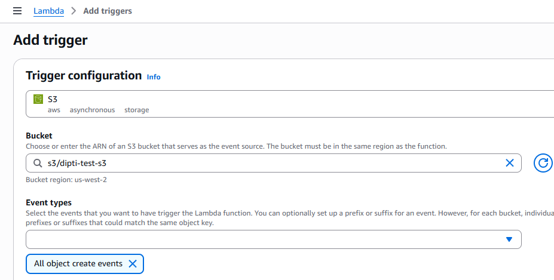
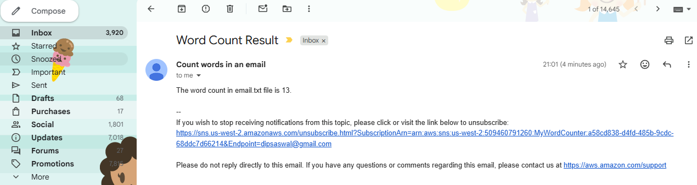
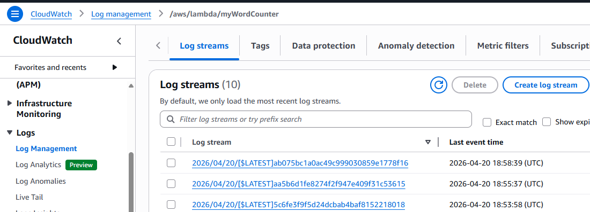
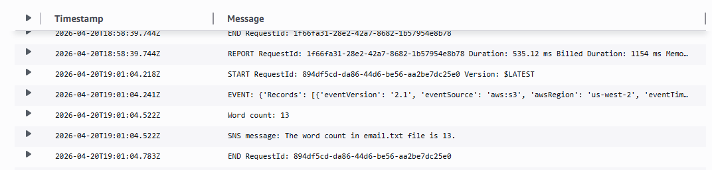

# Lab 177 – Challenge: AWS Lambda Word Count Exercise

In this lab, I built a serverless workflow using AWS Lambda, Amazon S3, and Amazon SNS. The goal was to automatically count words in a text file uploaded to S3 and send the result via email using SNS.

---

I started by creating an SNS topic named **MyWordCounter**. This topic would be used to send the final word count result to email subscribers.



After creating the topic, I added an email subscription and confirmed it through the verification email. At one point, I noticed the subscription got deactivated and I had to confirm it again to start receiving notifications properly.



Next, I created a Lambda function from the AWS Console using Python runtime. Since the lab restricted IAM role creation, I used the pre-existing **LambdaAccessRole**.

This role already included the required permissions:
- AWSLambdaBasicExecutionRole (CloudWatch logs)
- AmazonSNSFullAccess (publish notifications)
- AmazonS3FullAccess (read uploaded files)
- CloudWatchFullAccess (monitoring and logs)

After selecting the role, I created the function successfully.



Then I created an S3 bucket named **dipti-test-s3**. This bucket was used as the trigger source for the Lambda function. Whenever a text file is uploaded, it automatically invokes the Lambda function.

I configured the S3 trigger inside Lambda so that the function would respond to object upload events.



After setting up the trigger, I added the Lambda function code. The logic reads the file from S3, counts words using regex, and publishes the result to SNS.

```python
import boto3
import re

s3 = boto3.client('s3')
sns = boto3.client('sns')

TOPIC_ARN = "arn:aws:sns:us-west-2:509460791260:MyWordCounter"

def lambda_handler(event, context):

    print("EVENT:", event)

    record = event['Records'][0]
    bucket = record['s3']['bucket']['name']
    key = record['s3']['object']['key']

    response = s3.get_object(Bucket=bucket, Key=key)
    content = response['Body'].read().decode('utf-8')

    words = re.findall(r'\b\w+\b', content)
    count = len(words)

    message = f"The word count in {key} file is {count}."

    print("Word count:", count)
    print("SNS message:", message)

    sns.publish(
        TopicArn=TOPIC_ARN,
        Message=message,
        Subject="Word Count Result"
    )

    return message
```
---

After deployment, I uploaded a text file into the S3 bucket to trigger the Lambda function.

The function executed successfully and processed the file.

The SNS topic then sent an email containing the word count result.



After execution, I checked logs in Amazon CloudWatch to verify runtime behavior and troubleshoot if needed.





---

Challenges Faced

During this lab, I faced a few issues that required debugging and iteration:

Initially tested Lambda using manual test events instead of S3 upload triggers, which produced incorrect or empty event data.
Misunderstood S3 event structure, leading to issues in extracting bucket name and file key.
Lambda executed but sometimes returned no output due to incorrect deployment or incomplete updates.
SNS email subscription deactivated unexpectedly, requiring re-confirmation.
Debugging was mainly done using CloudWatch logs, which helped identify issues quickly.
Ensuring proper integration between S3, Lambda, and SNS required multiple configuration checks, especially IAM permissions and trigger setup.

---

By the end of the lab, I was able to:

Trigger Lambda automatically using S3 file uploads
Process file content and count words using Python
Publish results to SNS and receive email notifications
Use CloudWatch logs for debugging execution flow
Understand event-driven architecture using AWS services

