# Lab 178 – Work with AWS Lambda

This lab focused on building a data extraction and reporting workflow using AWS Lambda, IAM roles, VPC configuration, SNS notifications, and Systems Manager Parameter Store. The setup involved multiple Lambda functions interacting with a database and sending scheduled reports.

I started by reviewing IAM roles and checking how Lambda was allowed to interact with other AWS services. In `salesAnalysisReportRole`, I verified that Lambda had trust relationship with `lambda.amazonaws.com` and permissions like AmazonSNSFullAccess, AmazonSSMReadOnlyAccess, AWSLambdaBasicRunRole, and AWSLambdaRole. For `salesAnalysisReportDERole`, I confirmed AWSLambdaBasicRunRole and AWSLambdaVPCAccessRunRole were attached so the function could write logs and access resources inside a VPC.

Next, I created a Lambda layer to handle external dependencies required by the function. I selected Python 3.9/3.10 runtime and created the layer in the Lambda console. This layer was later attached to the data extractor function.

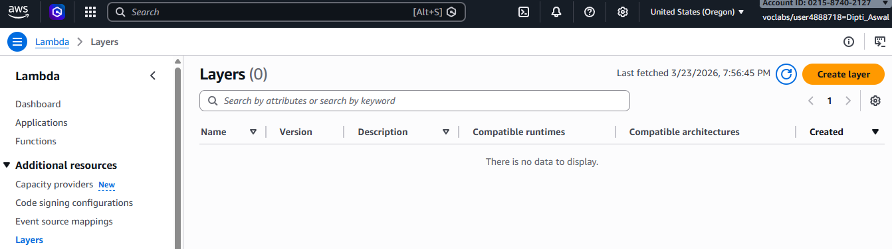

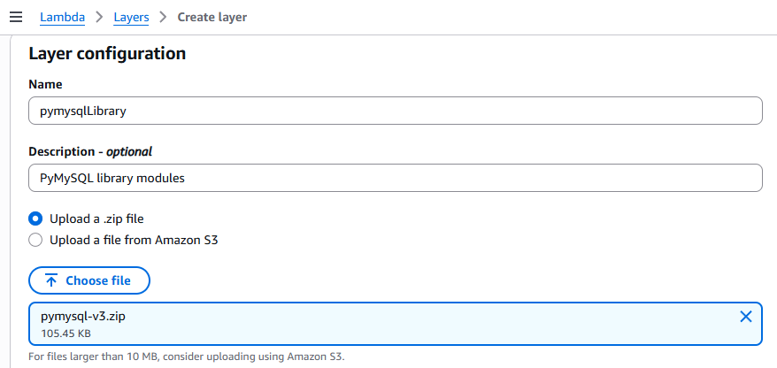

After that, I created the data extractor Lambda function using Python 3.10 and assigned it the existing execution role `salesAnalysisReportDERole`.

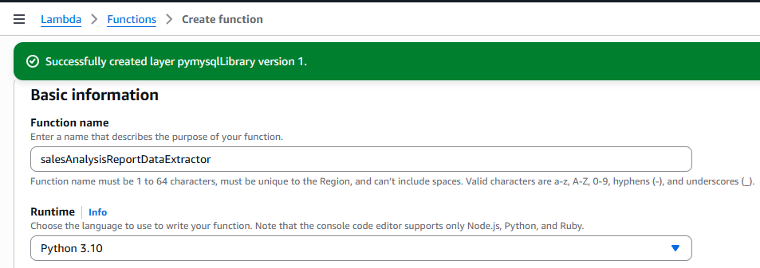

Once the function was created, I attached the Lambda layer through the configuration section under Layers → Edit. I selected the previously created layer and updated the runtime handler settings.

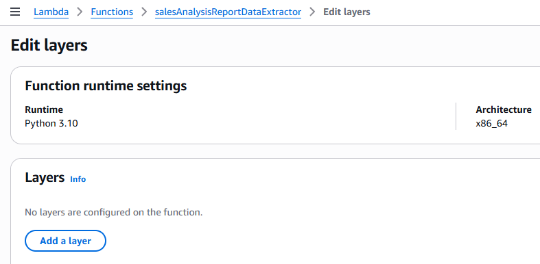

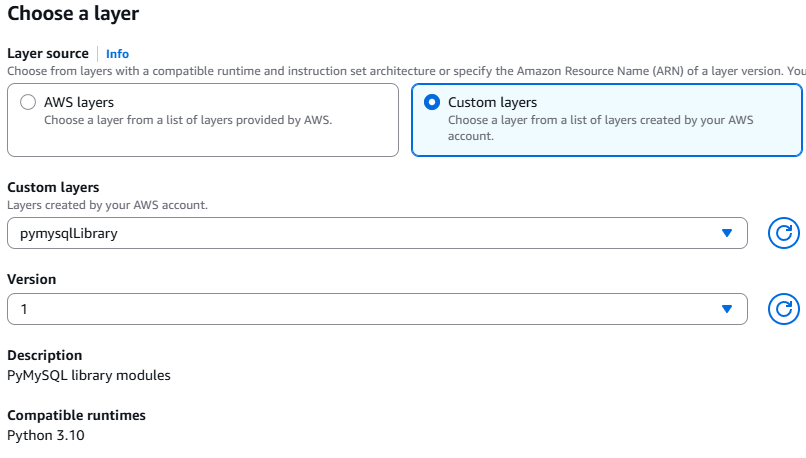

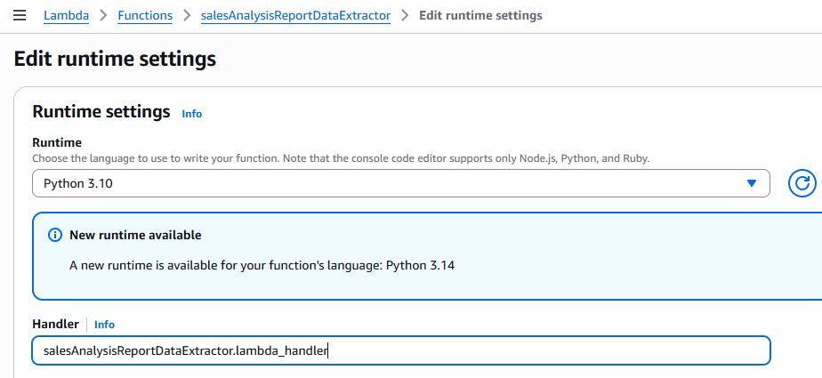

Then I uploaded the function code using the provided deployment package `salesAnalysisReportDataExtractor-v3.zip`.

After code upload, I configured VPC settings so the Lambda function could access the database securely. I selected Cafe VPC, Cafe Public Subnet 1, and CafeSecurityGroup.

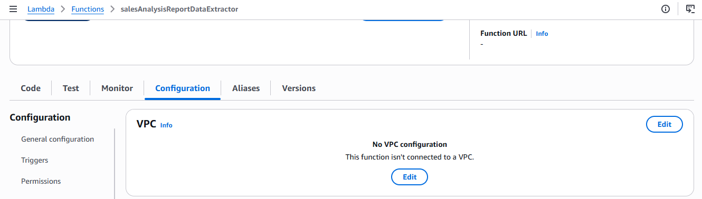

To support database connectivity, I configured AWS Systems Manager Parameter Store with required values like DB URL, database name, username, and password under `/cafe/*` paths.

When I tested the Lambda function using a sample event payload, the first execution failed due to a network issue.

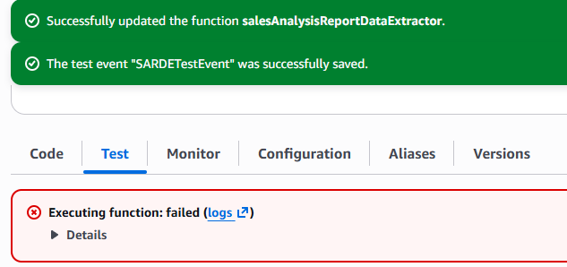

I identified that the security group did not allow MySQL traffic. I fixed this by adding an inbound rule for port 3306 in the CafeSecurityGroup.

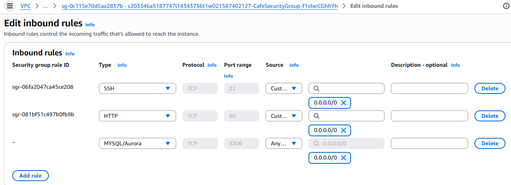

After applying the fix, I retested the function and it executed successfully.

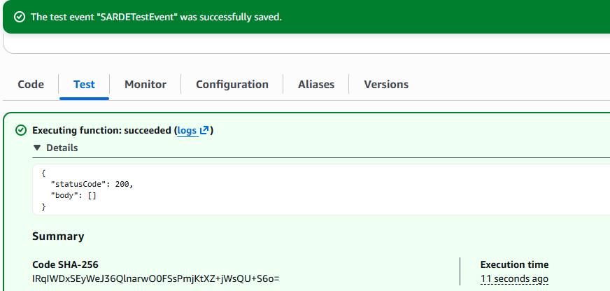

To generate real data, I accessed the EC2-hosted café application using its public URL and placed an order through the UI.

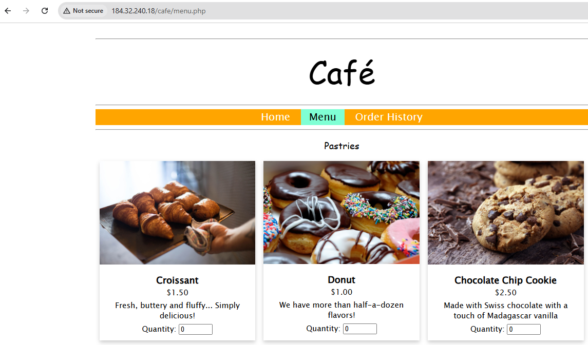

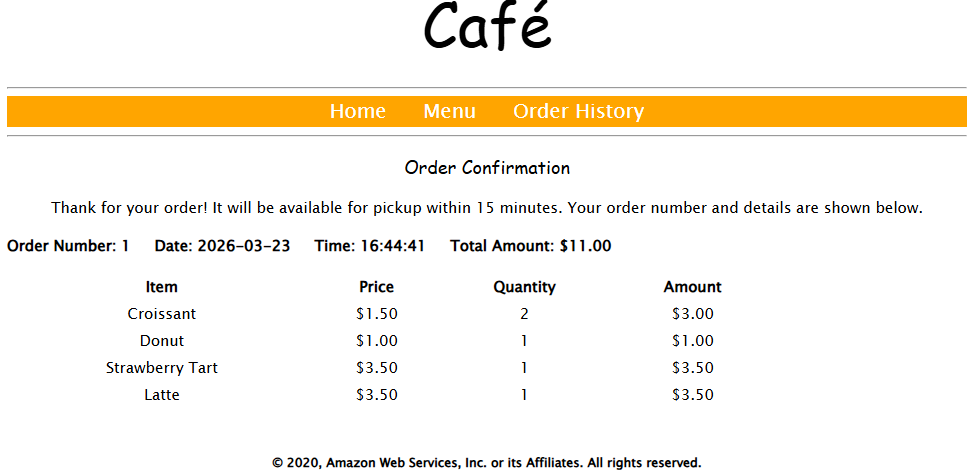

Then I went back to the Lambda function and tested it again to confirm it was pulling real order data from the database.

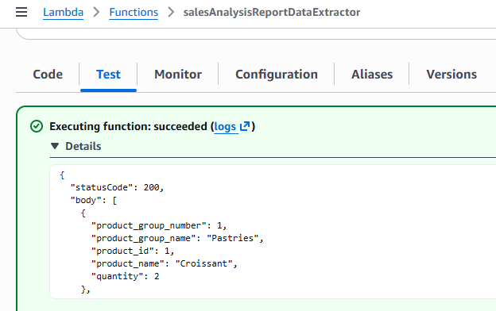

The function returned the expected structured response showing product groups, product names, and quantities ordered.

Next, I created an SNS topic named `salesAnalysisReportTopic` and subscribed my email address to receive notifications.

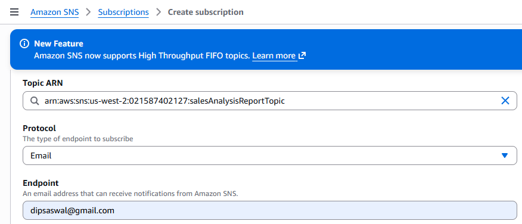

After that, I created another Lambda function called `salesAnalysisReport` using AWS CLI. I used the existing IAM role and uploaded the deployment package during creation.

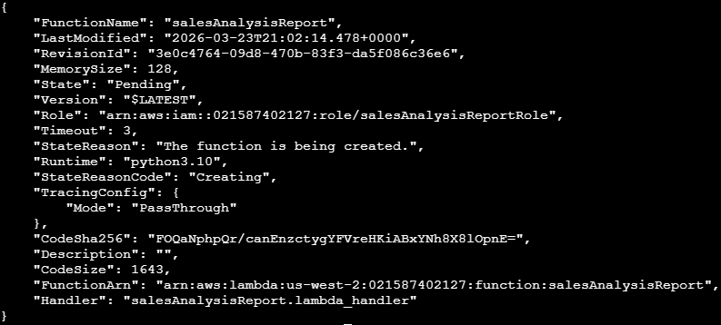

I then added an environment variable called `topicARN` and mapped it to the SNS topic ARN so the function could publish messages correctly.

Finally, I configured a trigger using CloudWatch Events (EventBridge) to run the Lambda function on a schedule. This allowed automated execution and sent email reports through SNS without manual intervention.

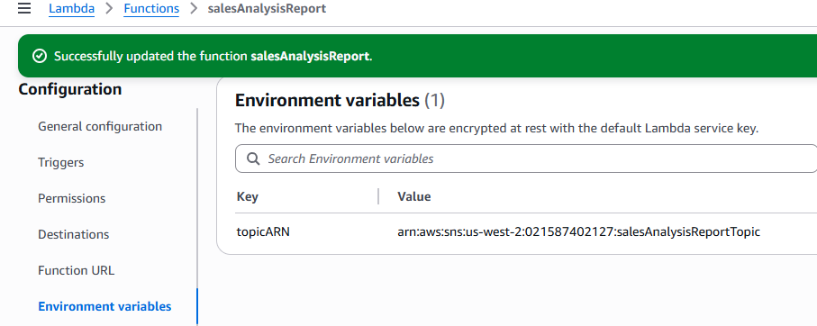

In the end, I was able to confirm the full flow: data extraction from database via Lambda, processing of order details, and automated email reporting through SNS. The lab helped connect IAM, Lambda, VPC networking, SSM Parameter Store, and EventBridge into one working pipeline.
