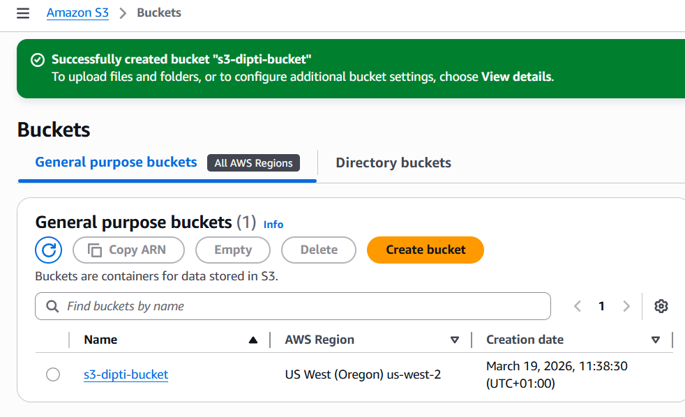
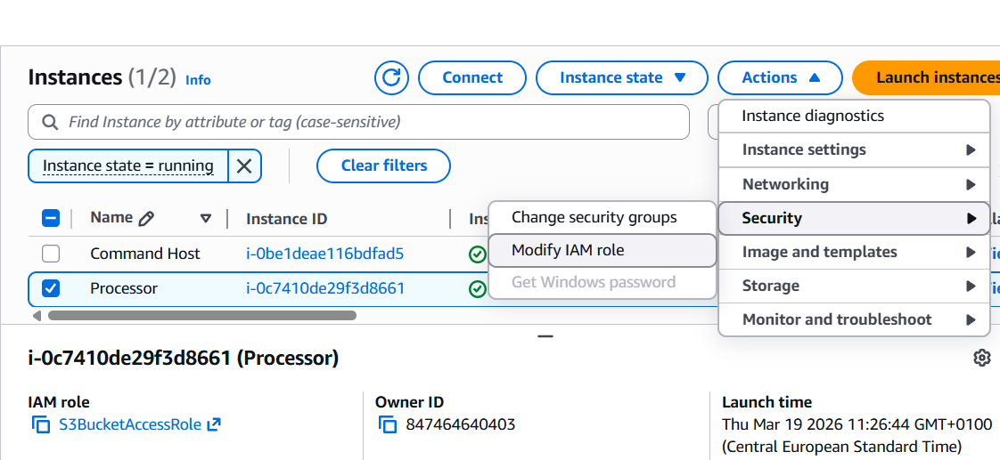
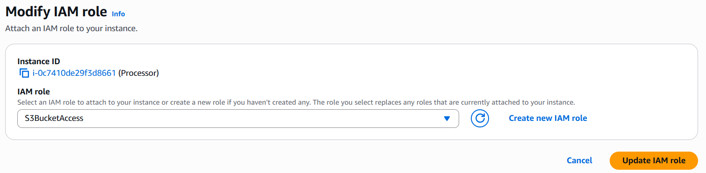

# Managing Storage

## Lab Overview  
In this lab, I worked on managing storage using Amazon EBS and AWS CLI. The focus was on creating snapshots, automating them using cron, and cleaning up old snapshots using a Python script. I also configured access between EC2 and S3.

---

## Creating and configuring resources  

### Creating S3 bucket  

I created an S3 bucket which will be used later to store data from the EBS volume.

---

### Attaching IAM role to Processor  

Next, I attached the IAM role to the Processor instance so it can interact with other AWS services like EBS and S3.

---

## Taking snapshots using AWS CLI  

### Connecting to Command Host  

I connected to the Command Host instance using EC2 Instance Connect.

---

### Getting Volume ID  

I ran the command to get the volume ID of the Processor instance:

aws ec2 describe-instances --filter 'Name=tag:Name,Values=Processor' --query 'Reservations[0].Instances[0].BlockDeviceMappings[0].Ebs.{VolumeId:VolumeId}'

Stopping Processor instance

Before taking the snapshot, I stopped the instance:

aws ec2 stop-instances --instance-ids i-0c7410de29f3d8661

Creating snapshot

Then I created the snapshot using the volume ID.

Restarting instance

After snapshot creation, I restarted the Processor instance.

Automating snapshots using cron

I created a cron job to take snapshots every minute:

echo "* * * * * /usr/bin/aws ec2 create-snapshot --volume-id vol-054f2adc5c57aaa5b >> /tmp/cronlog 2>&1" > cronjob
crontab cronjob

After waiting for a few minutes, multiple snapshots were created.

Managing snapshots using Python script

I stopped the cron job:

crontab -r

Then I ran the Python script to delete older snapshots:

python3.8 snapshotter_v2.py

The script deleted older snapshots and kept only the latest ones.

Verifying remaining snapshots

Finally, I checked the snapshots again and confirmed that only the latest snapshots were left.

aws ec2 describe-snapshots --filters "Name=volume-id,Values=vol-054f2adc5c57aaa5b" --query 'Snapshots[*].SnapshotId'
Conclusion

This lab helped me understand how to manage EBS snapshots using AWS CLI. I learned how to automate snapshot creation using cron and how to clean up old snapshots using a Python script. This is useful for maintaining backups without unnecessary storage usage.
