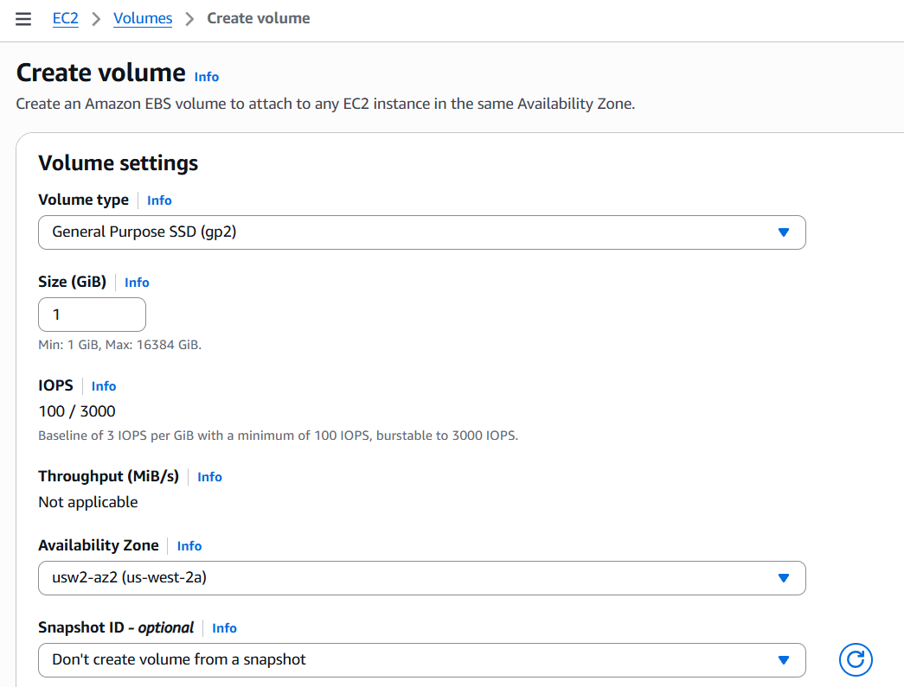
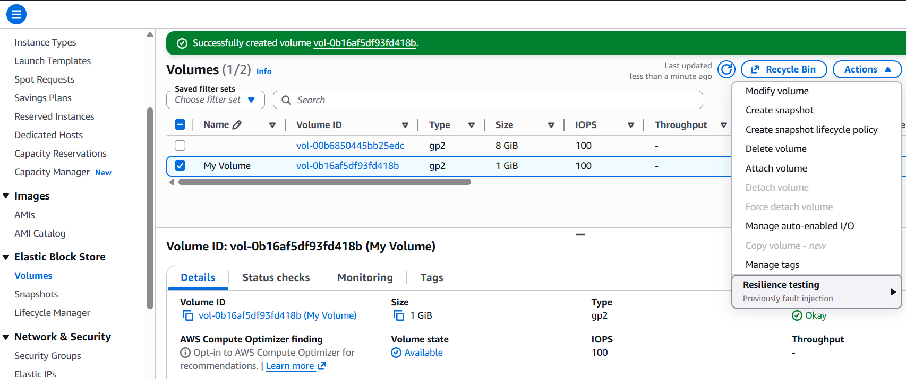
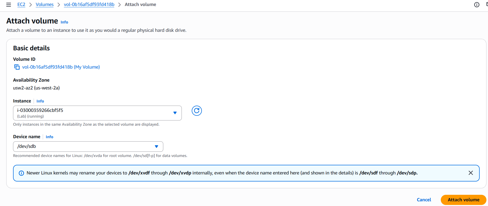
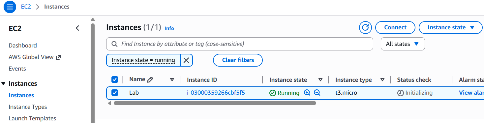

# Working with Amazon EBS

## Lab Overview  
In this lab, I worked with Amazon EBS and understood how storage can be added and managed for an EC2 instance. The focus was on creating a volume, attaching it to an instance, configuring it in Linux, and then using snapshots to back up and restore data.

---

## What I learned  
Through this lab, I learned how to create an EBS volume and attach it to a running EC2 instance. I also learned how to format the volume, mount it, and make sure it stays mounted even after a reboot. Another important part was understanding how snapshots work and how they can be used to restore deleted data.

---

## Steps performed  

### Creating the EBS volume  
I went to the EC2 console and opened the Volumes section. A new volume was created with a size of 1 GiB and type gp2. I made sure it was in the same Availability Zone as the EC2 instance. I also added a name tag as My Volume. After creation, I waited until the status changed to available.

  

---

### Attaching the volume  
Next, I selected the volume and attached it to the Lab EC2 instance using the device name /dev/sdb. After attaching, the volume status changed to in-use, which confirmed that it was connected to the instance.

---

### Connecting to the instance  
I used EC2 Instance Connect to open the terminal in the browser and connect to the instance.

---

### Configuring the file system  

Then I created a file system:

sudo mkfs -t ext3 /dev/sdb

Created directory:

sudo mkdir /mnt/data-store

Mounted volume:

sudo mount /dev/sdb /mnt/data-store

Made it persistent:

echo "/dev/sdb /mnt/data-store ext3 defaults,noatime 1 2" | sudo tee -a /etc/fstab

Verified:

df -h

Created test file:

echo "some text has been written" > /mnt/data-store/file.txt

Creating a snapshot

After working with the volume, I created a snapshot from it. I named it My Snapshot and waited for its status to change from pending to completed.

Deleting the file

To test the snapshot, I deleted the file I had created earlier from the mounted volume. I verified that the file was no longer present.

Restoring from snapshot
Creating a new volume

I created a new volume from the snapshot and named it Restored Volume. This volume contains the data from the snapshot.

Attaching restored volume

I attached this restored volume to the same EC2 instance using a different device name /dev/sdc. The status again changed to in-use.

Mounting restored volume

I created another directory and mounted the restored volume there. After mounting, I checked for the file and confirmed that it was restored successfully from the snapshot.

Conclusion

This lab helped me understand how EBS works in a practical way. I was able to create and attach storage, use it inside a Linux system, and take backups using snapshots. The most useful part was seeing how a deleted file could be recovered by restoring from a snapshot, which shows how important snapshots are for data backup and recovery.
