# Working with Amazon EBS

## Lab Overview  
In this lab, I worked with Amazon EBS and learned how to create a volume, attach it to an EC2 instance, configure it in Linux, and use snapshots to back up and restore data.

---

## Creating the EBS volume  

I started by going to the EC2 console and opening the Volumes section.

Then I created a new volume and added a tag.

The volume was created successfully.

I verified the volume details and configuration.

---

## Attaching the volume to EC2  

Next, I selected the volume and attached it to the Lab instance.

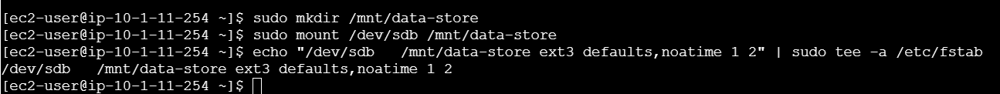

After attaching, I confirmed that the volume status changed to in-use.

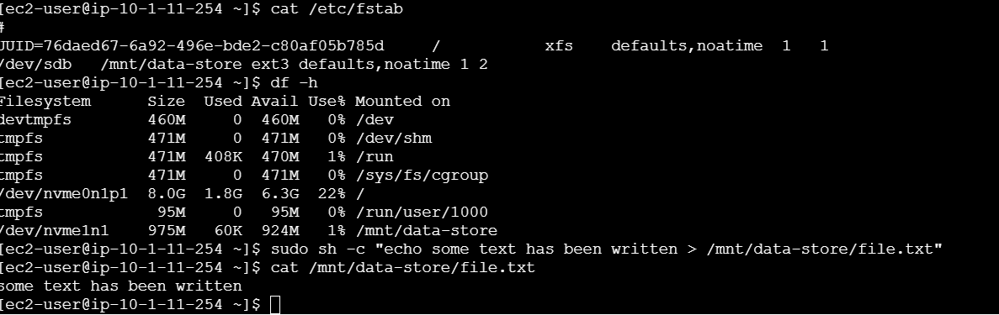

---

## Connecting to the instance  

I used EC2 Instance Connect to open the terminal.

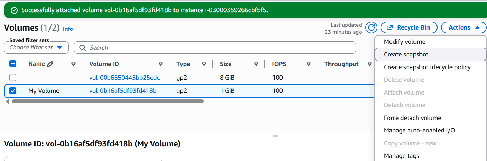

---

## Creating and configuring the file system  

I checked the existing storage using df -h, then created a file system on the new volume and mounted it.

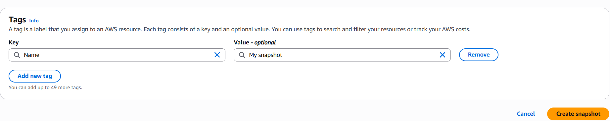

After mounting, I verified that the new storage was available.

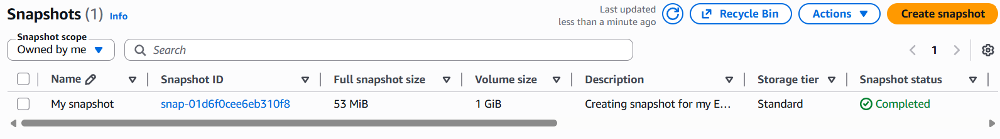

---

## Creating an Amazon EBS snapshot  

I created a snapshot from the volume.

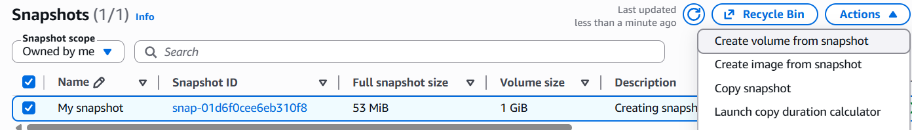

The snapshot was initially in pending state.

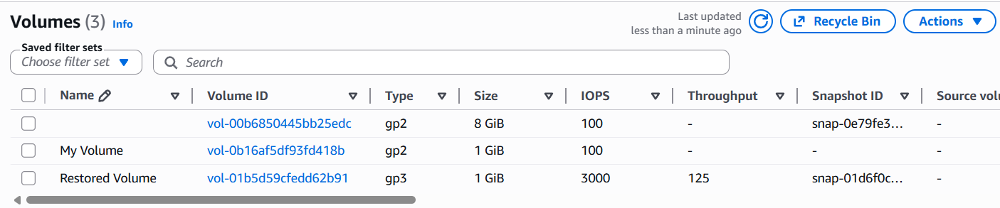

After some time, the snapshot status changed to completed.

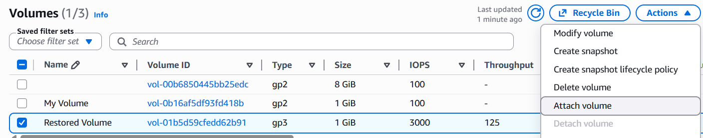

---

## Restoring the snapshot  

I created a new volume from the snapshot.

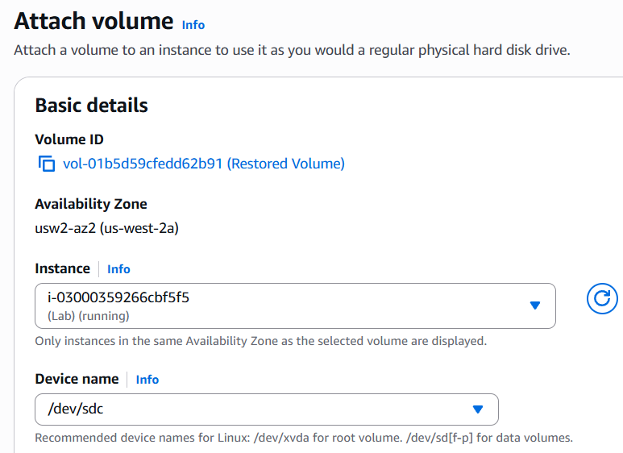

The restored volume was available and ready to use.

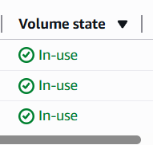

I attached and mounted the restored volume and verified that the file was recovered.

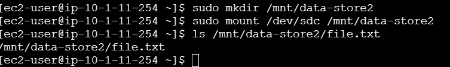

---

## Conclusion  

This lab helped me understand how EBS volumes work with EC2. I was able to create and attach storage, configure it in Linux, and use snapshots to back up and restore data when needed.
