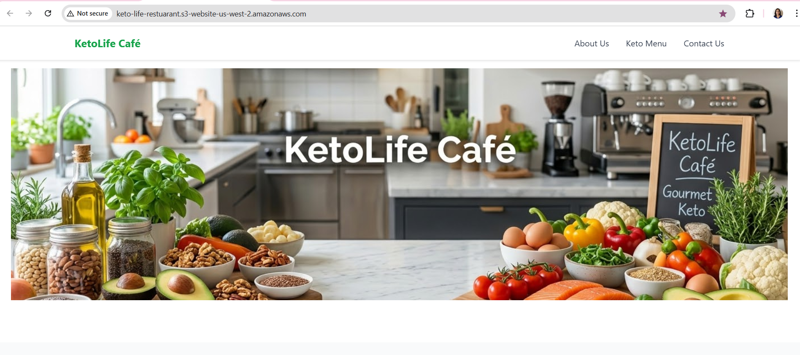
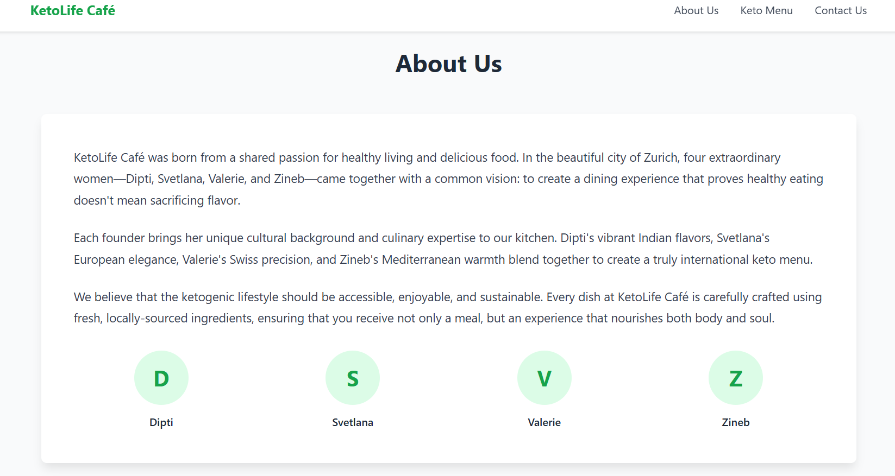
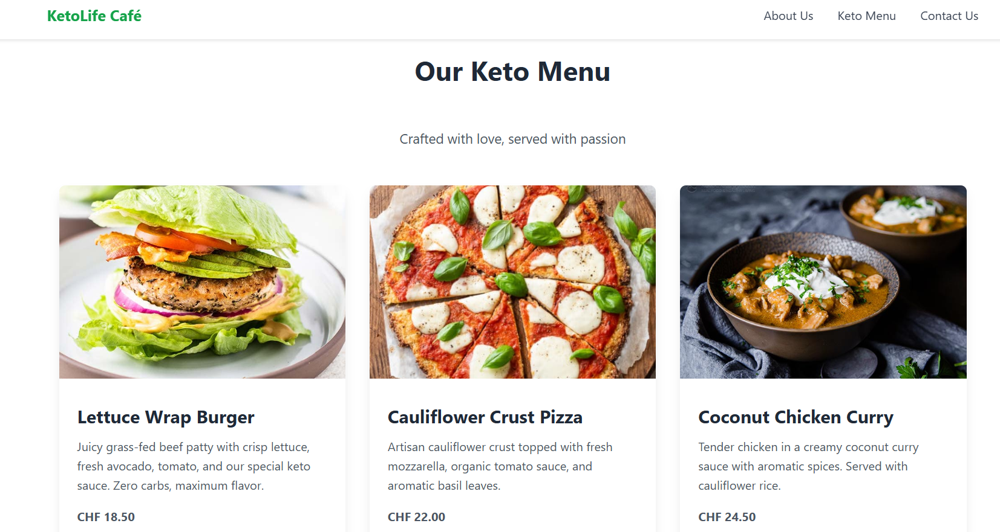
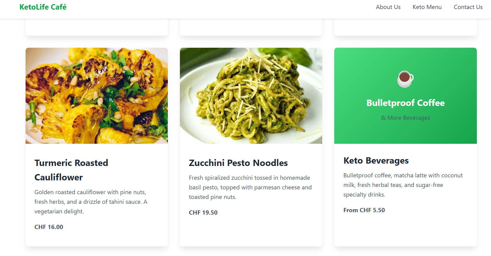
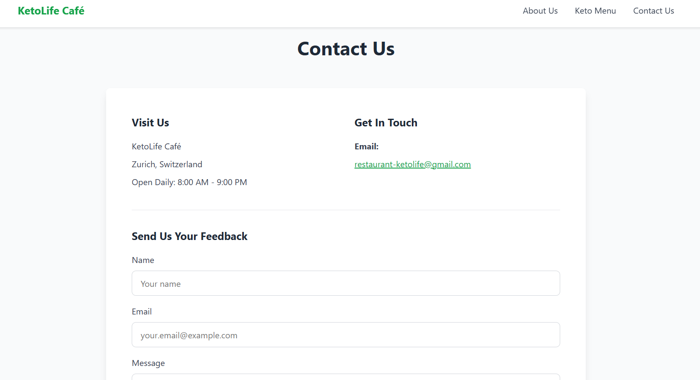
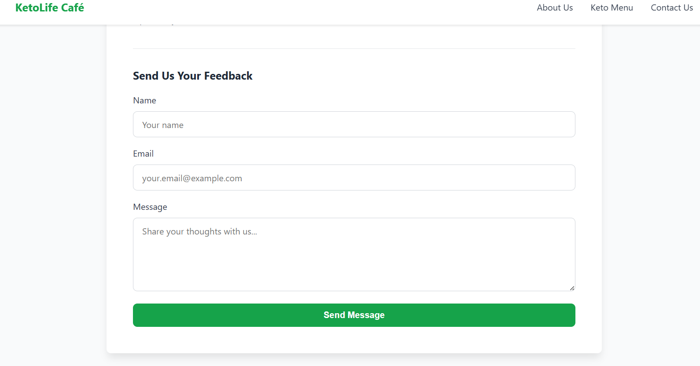

**KetoLife Café – Static Website on AWS**

**Authors**

    Dipti, Svetlana, Valerie, Zineb

**Project Overview**

    This project demonstrates the design, development, and deployment of a static restaurant website using AWS services. 
    The website was created for KetoLife Café, a keto-focused restaurant concept based in Zurich, with the goal of improving customer experience and streamlining interactions such as viewing menus and contacting the restaurant.
    
    The project also explores how cloud technologies can help small businesses transition to a more efficient digital model.

**Architecture Flow**

    1. The user accesses the website through a web browser. 
    
    2. The request is sent to the Amazon S3 static website endpoint.   
    
    3. S3 retrieves the requested files (HTML, CSS, images).  
    
    4. The website is rendered in the user’s browser.    
    
    5. This architecture is serverless, meaning:
    
        - No EC2 instances are required    
        
        - No backend server management is needed
        
        - AWS handles availability and scalability automatically

**AWS Services Used**

    - Amazon S3
    
    - Static website hosting
    
    - Storage for HTML, CSS, and images
    
    - Public access configuration

**Deployment Steps**

    1. Created HTML and CSS files for the website
    
    2. Organized assets (images, styles)
    
    3. Created an S3 bucket
    
    4. Enabled static website hosting
    
    5. Uploaded all website files and images
    
    6. Configured bucket policy for public access
    
    7. Accessed the website via S3 endpoint

**Screenshots**

    **Website url:** 
    http://keto-life-restuarant.s3-website-us-west-2.amazonaws.com

    

    

    
    

    
    

    
    
    
    
    
    
    
**Future Enhancements**

    To make the application more dynamic and production-ready:

    1. User Authentication
    
        Amazon Cognito for login and sign-up
    
    2. Backend Processing
    
        AWS Lambda for handling orders and bookings
        
    3. Database
    
        Amazon DynamoDB for storing customer data
    
    4. API Integration

        API Gateway to connect frontend and backend

**Benefits of Using AWS**

    - Scalability – easily handles increasing users
    
    - High Availability – reliable hosting infrastructure
    
    - Cost Efficiency – pay-as-you-go pricing
    
    - Security – controlled access and permissions

**Key Learnings**

    - Hosting static websites using Amazon S3
    
    - Managing bucket policies and permissions
    
    - Structuring a frontend project for deployment
    
    - Understanding real-world cloud migration use cases

**Live Demo**

(Add your S3 or GitHub Pages link here)

**Project Structure**
    ketolife-cafe/
    │
    ├── index.html
    ├── style.css
    ├── images/
    ├── screenshots/
    └── README.md
    
**Conclusion**

This project demonstrates how a simple static website hosted on AWS can help a small business establish a digital presence and improve customer interaction. It also lays the foundation for future cloud-based enhancements such as authentication, backend processing, and database integration.

